## Commerce

[план обмена](https://github.com/badhitman/BlankCRM/blob/main/CommerceService/INTEGRATION.md)

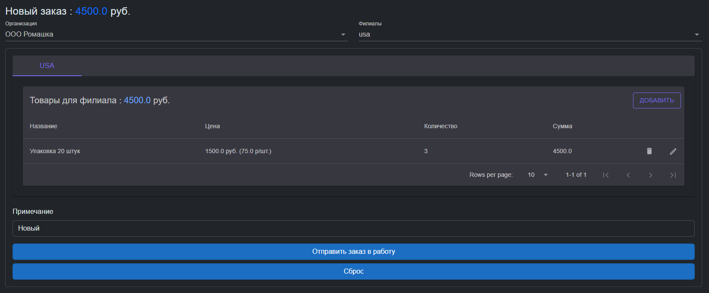

### Контрагенты

Перечень контрагентов
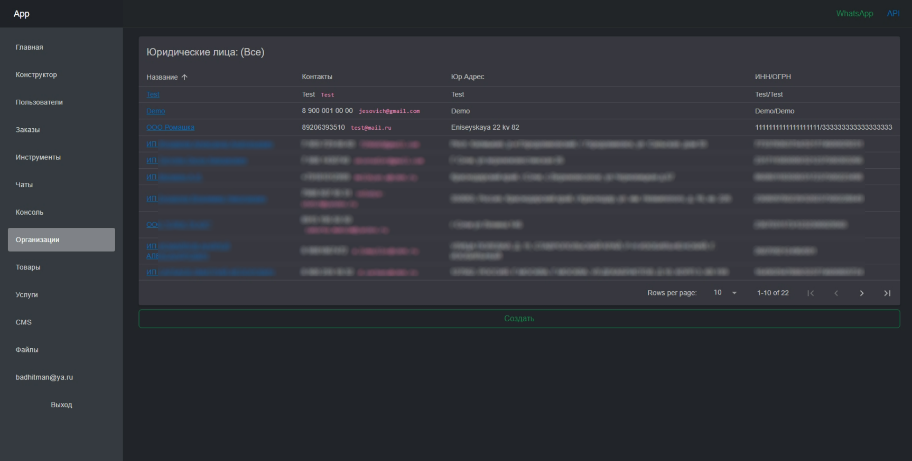

Карточка организации
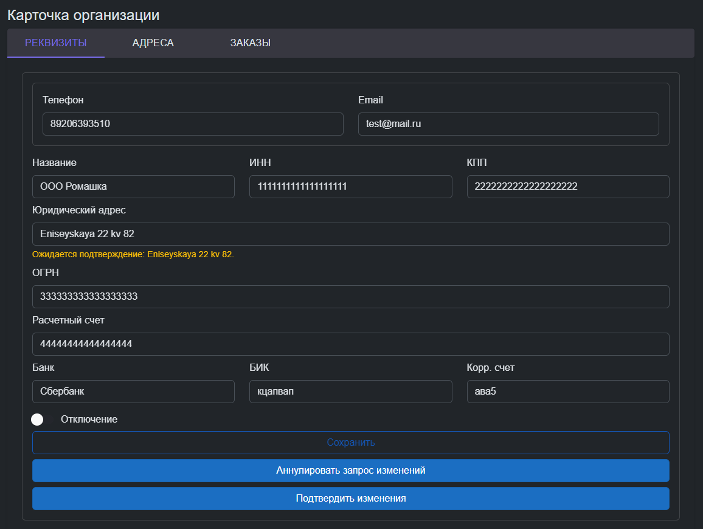

#### Адреса контрагентов

Перечень адресов организации
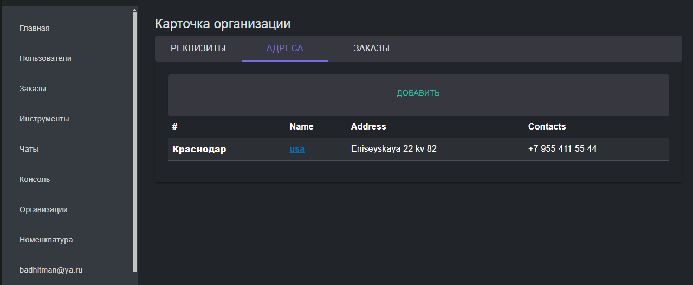

Адрес организации
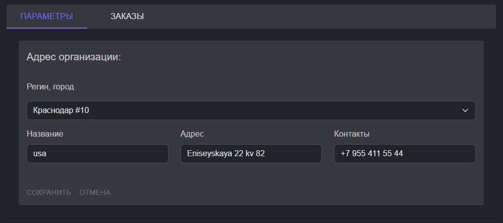

### Номенклатура

Справочник номенклатуры
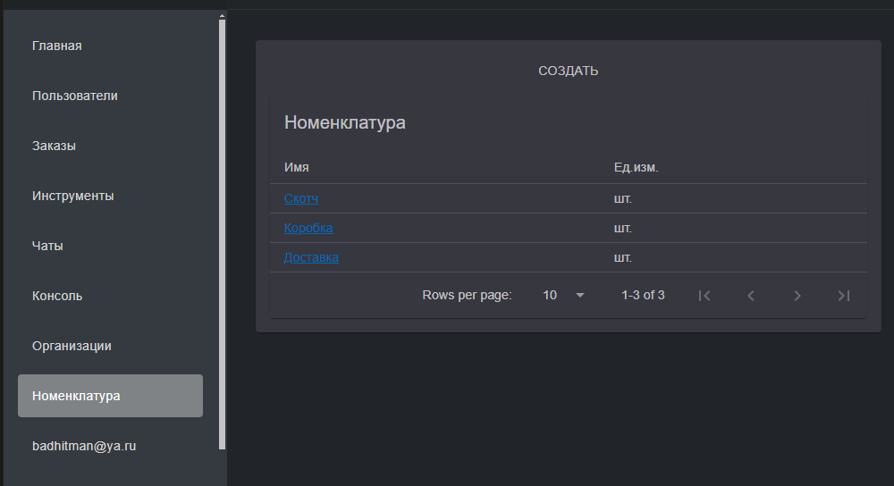

Торговые позиции по номенклатуре
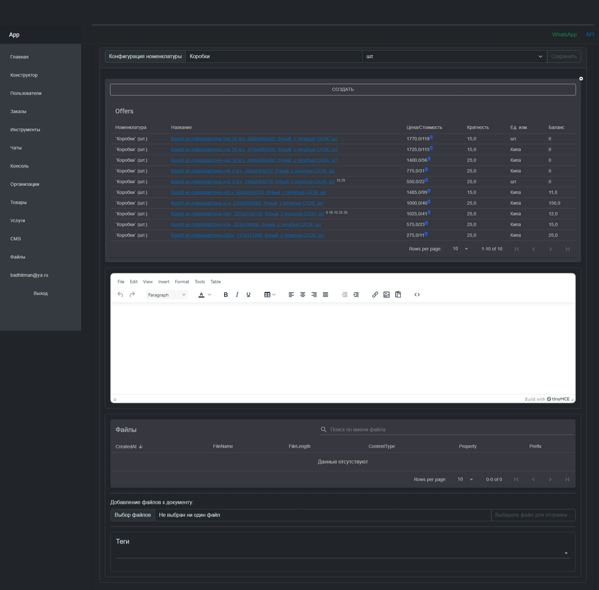

Настройка торгового предложения
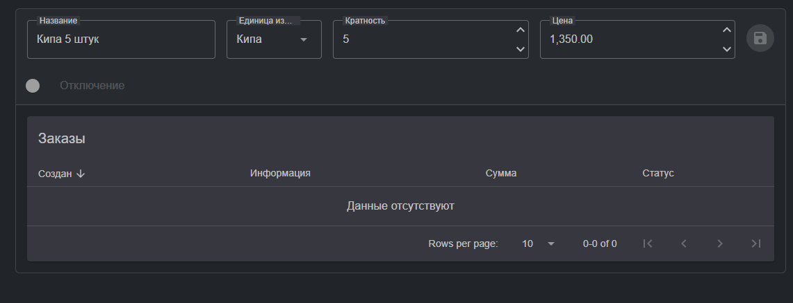

Настройка ценообразования
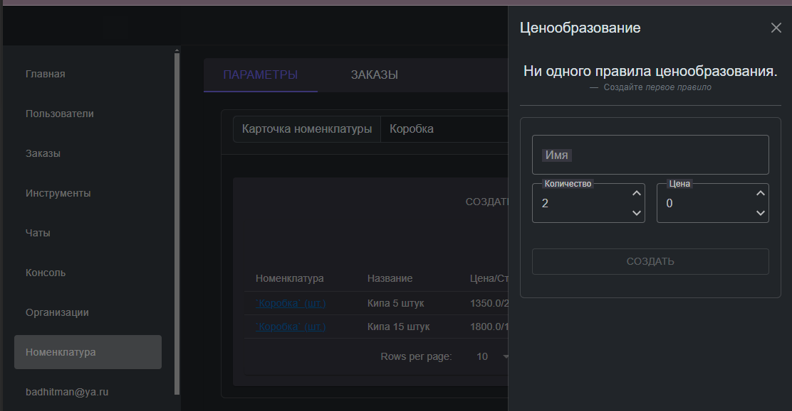

#### Расписание (график работы)
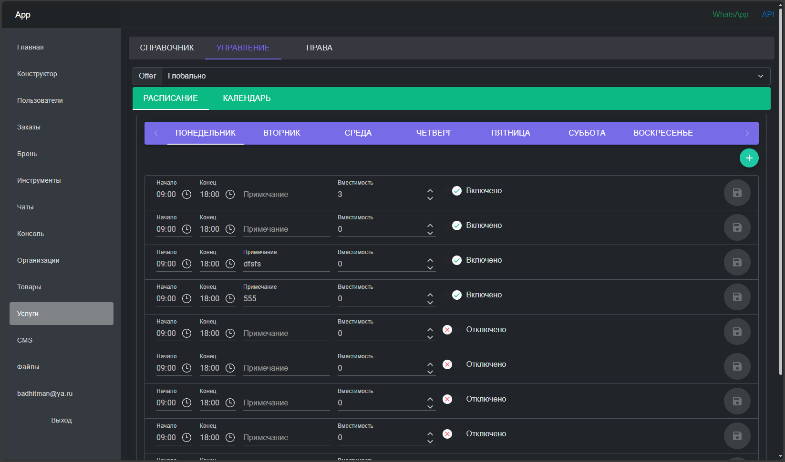
Календарь
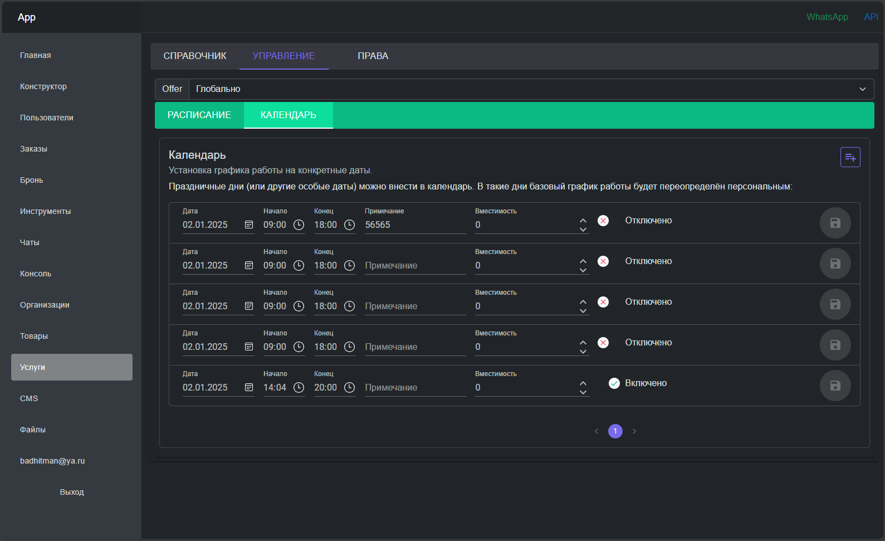

#### Подрядчики
Назначение прав организациям оказывать услуги. Они будут доступны клиенту в процессе формирования записей:
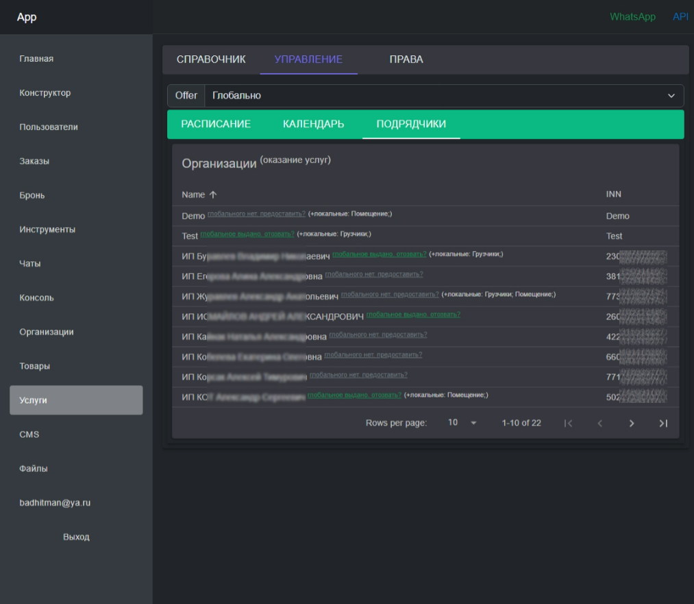

Подойдёт для сдачи в аренду чего-либо (помещение, транспорт и т.д.) или для записи на услуги (парикмахер, шиномонтаж и т.д.)
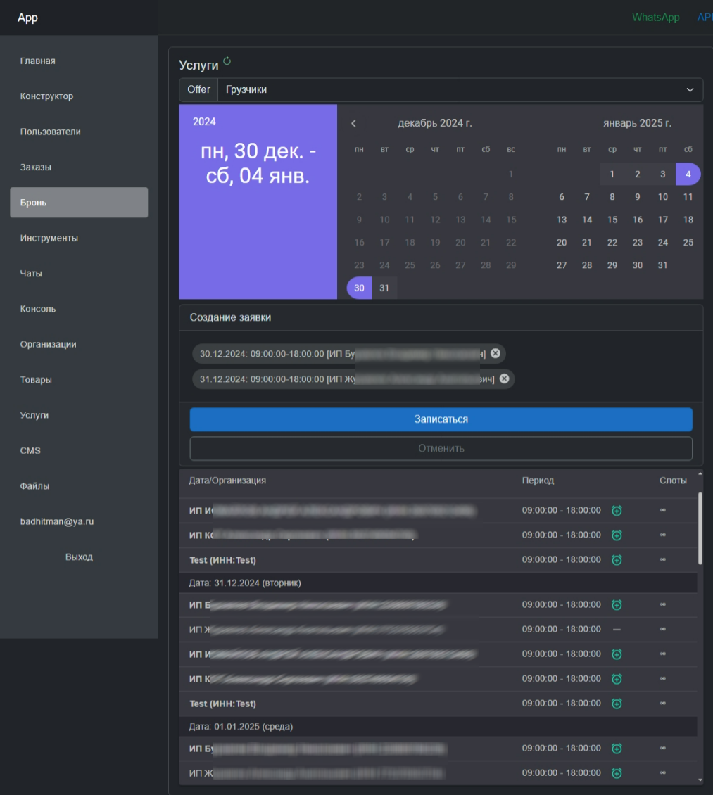

#### Уведомления (шаблоны)
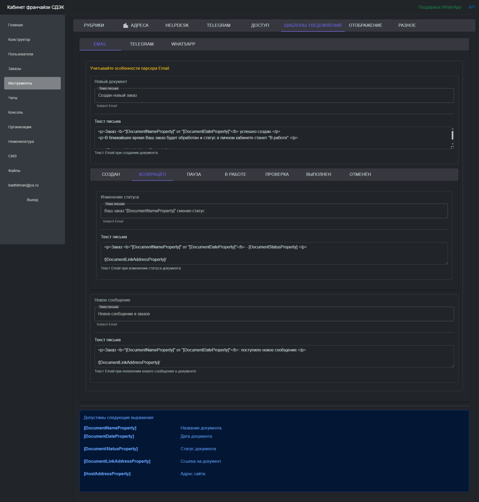

#### Настройки отображения
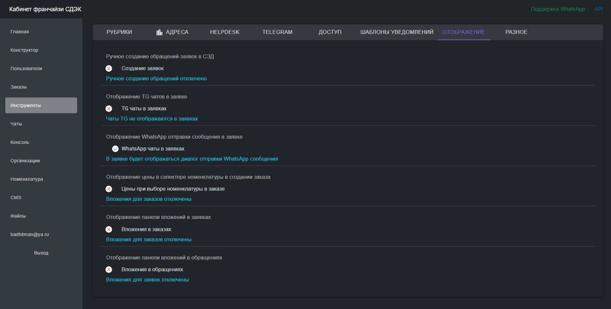