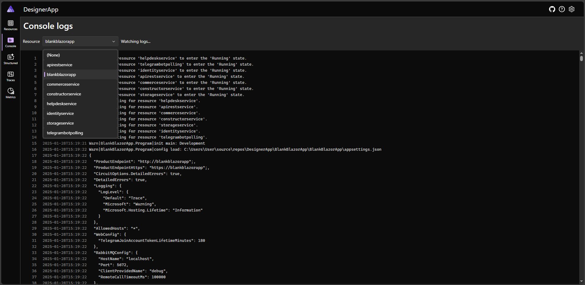

# .NET Aspire - быстрый запуск

 

По умолчанию трассируются события выполнения команд на уровне шины транспорта MQ:


Логи наравне с БД и файлами, транслируется в Aspire:


Консолидированный вывод терминала:


> [!WARNING]
> Для запуска решения предварительно потребуется установленные **VisualStudio**, **.NET 9** и **Docker**.
Кроме того, потребуются:  **PostgreSQL**, **RabbitMQ**, **Redis**, **MongoDB** (например, в том же `Docker`-е).
Параметры подключения (секреты) нужно разместить в папке с именем `secrets-DesignerApp.AppHost`, но уровнем вложенности выше по отношению к папке приложения (например: `../secrets-DesignerApp.AppHost` или ещё выше в иерархии `../../..`, но глубиной не дальше пяти переходов). Оркестратор сам передаст требуемые параметры в нужные службы. В таком случае достаточно запустить `DesignerApp.AppHost`.

## Шаблоны/примеры секретов
Aspire хост (`DesignerApp.AppHost`) настраивается в одном месте, а подчинённые службы получают **данные подключений** через переменные окружения от оркестратора.

#### Строки подключения (СУБД + Redis):
```json
{
  "ConnectionStrings": {
    "RedisConnectionString": "localhost,defaultDatabase=0",

    "CommerceConnection": "Server=localhost;Port=5432;User Id=dev;Password=dev;Database=CommerceContext",
    "IdentityConnection": "Server=localhost;Port=5432;User Id=dev;Password=dev;Database=IdentityContext",
    "TelegramBotConnection": "Server=localhost;Port=5432;User Id=dev;Password=dev;Database=TelegramBotContext",
    "MainConnection": "Server=localhost;Port=5432;User Id=dev;Password=dev;Database=MainContext",
    "CloudParametersConnection": "Server=localhost;Port=5432;User Id=dev;Password=dev;Database=StorageContext",
    "HelpdeskConnection": "Server=localhost;Port=5432;User Id=dev;Password=dev;Database=HelpDeskContext",
    "ConstructorConnection": "Server=localhost;Port=5432;User Id=dev;Password=dev;Database=ConstructorContext"
  }
}
```

Хост Aspire так же транслирует в подчинённые службы имя рабочего контура `Transmission.Receives` для [разделения различных экземпляров решения, использующих одну общую инфраструктуру (MQ, DB, Mongo, Redis)](https://github.com/badhitman/DesignerApp?tab=readme-ov-file#stage-%D0%BA%D0%BE%D0%BD%D1%82%D1%83%D1%80). При использовании именованных рабочих контуров требуется предусмотреть и наличие необходимых строк подключения в секретах: к имени строки в конец подключения добавляется имя контура. Если имя контура `_second`, тогда строки подключений должны оканчиваться на `_second`. Примерно так:
```json
{
  "ConnectionStrings": {
    "RedisConnectionString_second": "localhost,defaultDatabase=1",

    "CommerceConnection_second": "Server=localhost;Port=5432;User Id=dev;Password=dev;Database=CommerceContext",
    "IdentityConnection_second": "Server=localhost;Port=5432;User Id=dev;Password=dev;Database=IdentityContext",
    "TelegramBotConnection_second": "Server=localhost;Port=5432;User Id=dev;Password=dev;Database=TelegramBotContext",
    "MainConnection_second": "Server=localhost;Port=5432;User Id=dev;Password=dev;Database=MainContext",
    "CloudParametersConnection_second": "Server=localhost;Port=5432;User Id=dev;Password=dev;Database=StorageContext",
    "HelpdeskConnection_second": "Server=localhost;Port=5432;User Id=dev;Password=dev;Database=HelpDeskContext",
    "ConstructorConnection_second": "Server=localhost;Port=5432;User Id=dev;Password=dev;Database=ConstructorContext"
  }
}
```
> [!IMPORTANT]
> Обратите внимание, что в примере для Redis я так же сменил номер БД с нуля на единицу: `defaultDatabase=1`, что бы данные разных контуров были разделены на логическом уровне.


#### SMTP - отправка email:
```json
{
  "SmtpConfig": {
    "PublicName": "yuour title name",
    "Email": "email@domain.com",
    "Login": "login_auth_",
    "Password": "your_pass",

    "Host": "smtp address",
    "Port": 465
  }
}
```

#### MongoDB - файловое хранилище:
```json
{
  "MongoDBConfig": {
    "Sheme": "mongodb",
    "Host": "localhost",
    "Port": 27017,
    "Login": "",
    "Password": ""
  }
}
```

#### RabbitMQ - транспорт:
```json
{
	"RabbitMQConfig": {
		"UserName": "debug",
		"Password": "debug",
		"VirtualHost": "/"
	}
}
```

#### TelegramBot токен:
```json
{
  "BotConfiguration": {
    "BotToken": "111777000:xxxyyyxxxyyyxxxyyy"
  }
}
```

#### Api access Tokens
```json
{
	"ApiAccess": {
		"Permissions": [
			{
				"User": "testSystem",
				"Secret": "XXXXXXX-BBBB-000000-RRRRRRRR-OOOOOOOO",
				"Roles": [
					"SystemRoot"
				]
			},
			{
				"User": "test",
				"Secret": "XXXXXXX-BBBB-000000-RRRRRRRR-OOOOOOOO",
				"Roles": [
					"OrganizationsWriteCommerce",
					"PaymentsWriteCommerce",
					"OrdersWriteCommerce"
				]
			}
		]
	}
}
```

Секреты можно разместить по собственным файлам иил объединить в один:
```json
{
	"ConnectionStrings": {
		"RedisConnectionString": "localhost,defaultDatabase=0",
		"CommerceConnection": "Server=localhost;Port=5432;User Id=dev;Password=dev;Database=CommerceContext",
		"IdentityConnection": "Server=localhost;Port=5432;User Id=dev;Password=dev;Database=IdentityContext",
		"TelegramBotConnection": "Server=localhost;Port=5432;User Id=dev;Password=dev;Database=TelegramBotContext",
		"MainConnection": "Server=localhost;Port=5432;User Id=dev;Password=dev;Database=MainContext",
		"CloudParametersConnection": "Server=localhost;Port=5432;User Id=dev;Password=dev;Database=StorageContext",
		"HelpdeskConnection": "Server=localhost;Port=5432;User Id=dev;Password=dev;Database=HelpDeskContext",
		"ConstructorConnection": "Server=localhost;Port=5432;User Id=dev;Password=dev;Database=ConstructorContext"
	},
	"BotConfiguration": {
		"BotToken": "111777000:xxxyyyxxxyyyxxxyyy"
	},
	"RabbitMQConfig": {
		"UserName": "debug",
		"Password": "debug",
		"VirtualHost": "/"
	},
	"MongoDBConfig": {
		"Sheme": "mongodb",
		"Host": "localhost",
		"Port": 27017,
		"Login": "",
		"Password": ""
	},
	"SmtpConfig": {
		"PublicName": "yuour title name",
		"Email": "email@domain.com",
		"Login": "login_auth_",
		"Password": "your_pass",
		"Host": "smtp address",
		"Port": 465
	},
	"ApiAccess": {
		"Permissions": [
			{
				"User": "testSystem",
				"Secret": "XXXXXXX-BBBB-000000-RRRRRRRR-OOOOOOOO",
				"Roles": [
					"SystemRoot"
				]
			},
			{
				"User": "test",
				"Secret": "XXXXXXX-BBBB-000000-RRRRRRRR-OOOOOOOO",
				"Roles": [
					"OrganizationsWriteCommerce",
					"PaymentsWriteCommerce",
					"OrdersWriteCommerce"
				]
			}
		]
	}
}
```