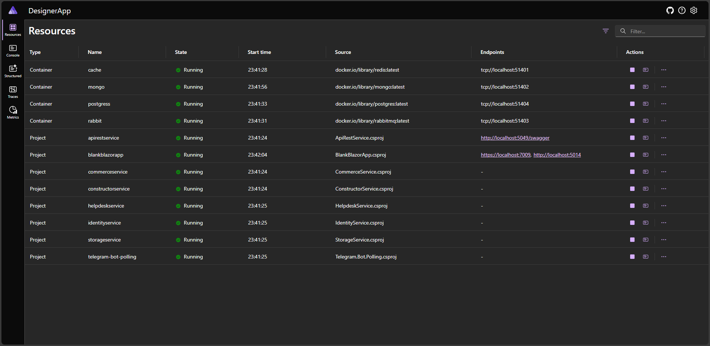
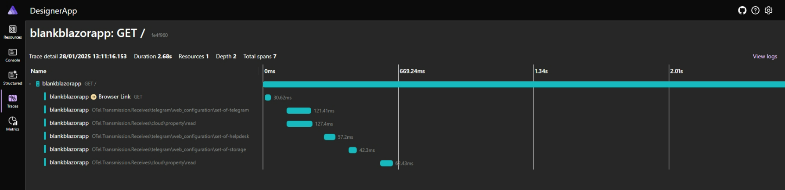
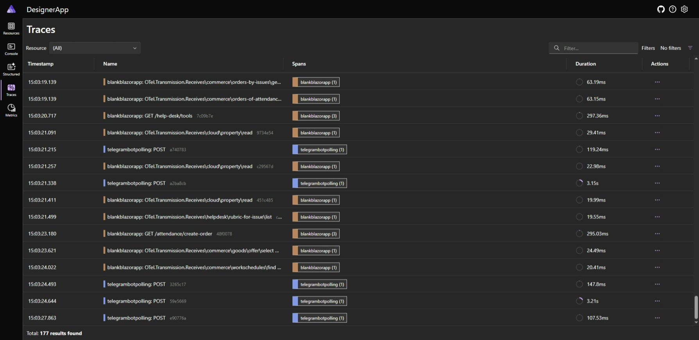
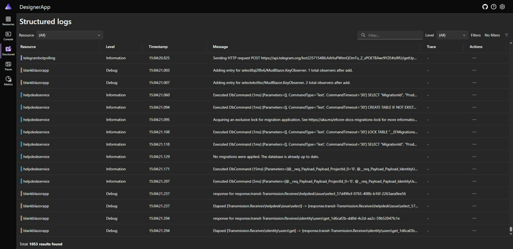

# .NET Aspire - быстрый запуск
Для запуска решения предварительно потребуется установленные **VisualStudio**, **.NET 9** и **Docker**.
Кроме того, потребуются:  **PostgreSQL**, **RabbitMQ**, **Redis**, **MongoDB** (например, в том же `Docker`-е).
Параметры подключения (секреты) нужно разместить в папке с именем `secrets-DesignerApp.AppHost`, но уровнем вложенности выше по отношению к папке приложения (например: `../secrets-DesignerApp.AppHost` или ещё выше в иерархии `../../..`, но глубиной не дальше пяти переходов). Оркестратор сам передаст требуемые параметры в нужные службы. В таком случае достаточно запустить `DesignerApp.AppHost`.


 







### Шаблоны - файл(ы) секретов

Строки подключения (СУБД + Redis):
```
{
  "ConnectionStrings": {
    "RedisConnectionString": "localhost,defaultDatabase=0",

    "CommerceConnection": "Server=localhost;Port=5432;User Id=dev;Password=dev;Database=CommerceContext",
    "IdentityConnection": "Server=localhost;Port=5432;User Id=dev;Password=dev;Database=IdentityContext",
    "TelegramBotConnection": "Server=localhost;Port=5432;User Id=dev;Password=dev;Database=TelegramBotContext",
    "MainConnection": "Server=localhost;Port=5432;User Id=dev;Password=dev;Database=MainContext",
    "CloudParametersConnection": "Server=localhost;Port=5432;User Id=dev;Password=dev;Database=StorageContext",
    "HelpdeskConnection": "Server=localhost;Port=5432;User Id=dev;Password=dev;Database=HelpDeskContext",
    "ConstructorConnection": "Server=localhost;Port=5432;User Id=dev;Password=dev;Database=ConstructorContext"
  }
}
```

SMTP - отправка email:
```
{
  "SmtpConfig": {
    "PublicName": "yuour title name",
    "Email": "email@domain.com",
    "Login": "login_auth_",
    "Password": "your_pass",

    "Host": "smtp address",
    "Port": 465
  }
}
```

MongoDB - файловое хранилище:
```
{
  "MongoDBConfig": {
    "Sheme": "mongodb",
    "Host": "localhost",
    "Port": 27017,
    "Login": "",
    "Password": ""
  }
}
```

RabbitMQ - транспорт:
```
{
	"RabbitMQConfig": {
		"UserName": "debug",
		"Password": "debug",
		"VirtualHost": "/"
	}
}
```

TelegramBot токен:
```
{
  "BotConfiguration": {
    "BotToken": "111777000:xxxyyyxxxyyyxxxyyy"
  }
}
```