Клиенты могут отправлять свои обращения через web сайт используя свои логин/пароль, либо вести переписку прямо с TelegramBot не зная кто им отвечает. Таким образом клиенту не обязательно посещать сайт. Клиенту не обязательно даже иметь аккаунт (регистрироваться на сайте). Уведомления рассылаются от бота Телеграм и/или Email. Все входящие сообщения от клиентов переадресовываются в указанные вами чаты Telegram, где любой участник чата (сотрудники) могут ответить на любое такое входящее сообщение [прямо в самом чате](https://github.com/badhitman/DesignerApp/tree/main/HelpdeskService#%D1%8D%D0%BA%D1%81%D0%BF%D1%80%D0%B5%D1%81%D1%81-%D0%BE%D1%82%D0%B2%D0%B5%D1%82%D1%8B).

Рекомендуется подключать к обслуживанию именно групповые чаты, а не личные = это избавит от потенциальных сложностей в процессе эксплуатации системы. Буквально для каждого клиента создавать отдельный чат и туда уже добавлять бота и сотрудников, которые обслуживают клиента (даже если такой сотрудник один). Подобная практика придаст больше гибкости и масштабируемости решению благодаря возможностям самого Telegram. В конце концов во все эти чаты можно так же добавлять руководителей для мониторинга процессов. Туда будут приходить все важные уведомления касательно клиента и открытых по нему обращений, а клиент будет вести общение с TelegramBot.

Кроме того, бэк данной информационной системы можно использовать отдельно от фронта: связь между фронтом и бэком через RabbitMQ.

## Рубрики
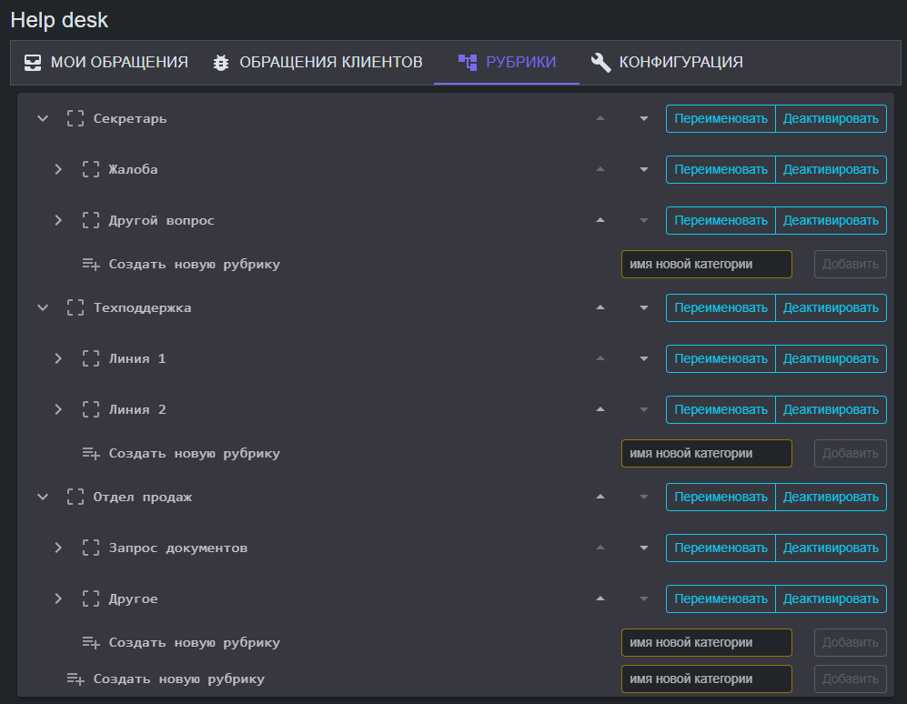

Категории/рубрики обращений. Кроме текста самого обращения клиент должен указать категорию/рубрику/тему. Это меню редактируется/настраивается отдельно (вложенность не ограничена). Режим выбора клиентом рубрик [настраивается отдельно](https://github.com/badhitman/DesignerApp/tree/main/HelpdeskService#%D0%BD%D0%B0%D1%81%D1%82%D1%80%D0%BE%D0%B9%D0%BA%D0%B8).

## Журнал
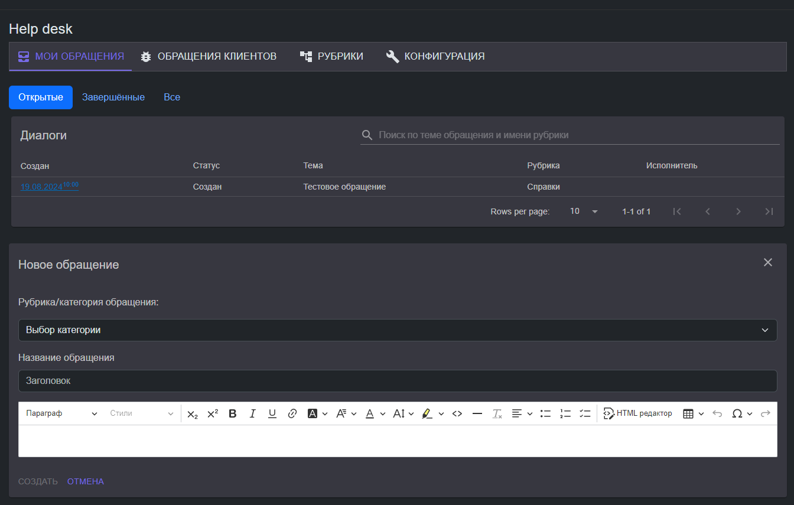

Журнал обращений. В зависимости от прав, набор вкладок/доступов различный.
Для исполнителя журнал похож на клиентский. Ключевое отличие заключается в работе фильтров и смене колонки (исполнитель <-> автор).

## Консоль
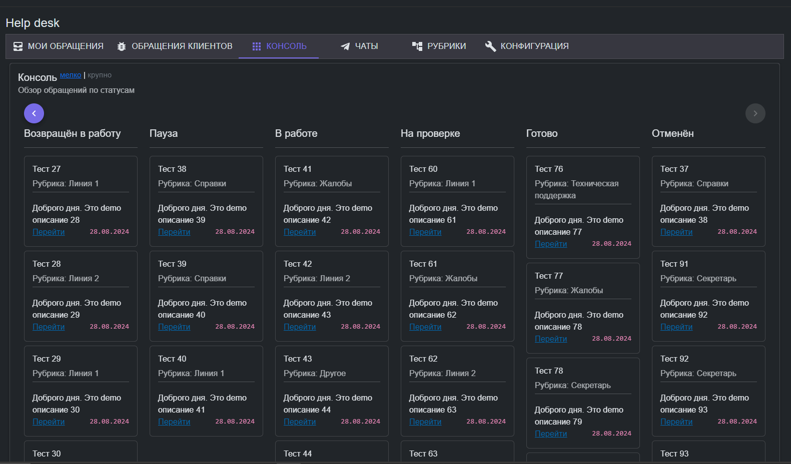

Консоль отображает все обращения с разбивкой по статусам. Кнопками Влево/Вправо двигает колонки для отображения тех областей, которые не влезают. Две размерности колонок:
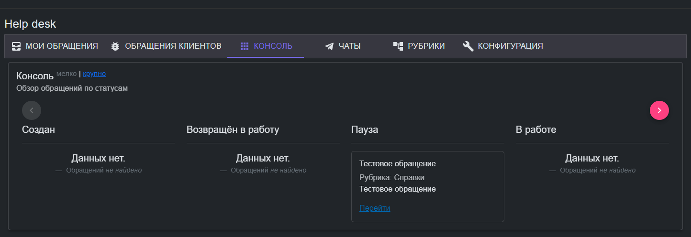

## Диалог внутри обращения
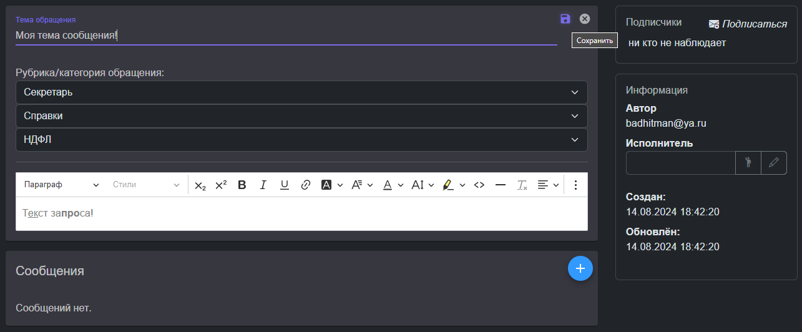

В любом обращении сотрудникам доступна карточка клиента текущего автора обращения:

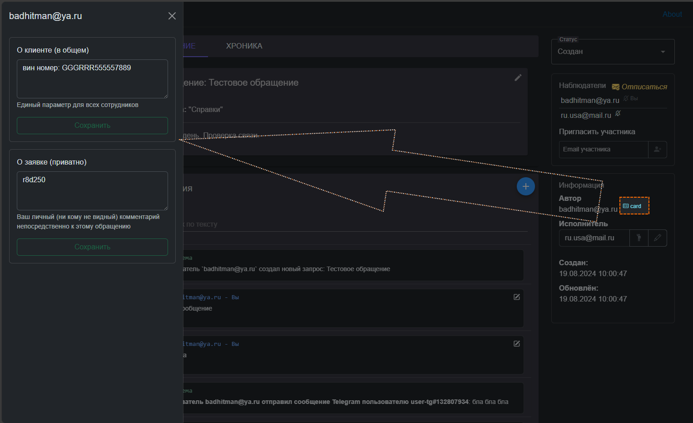

В карточке клиента доступны настройки пересылки ботом входящих сообщений от клиента и записки.

#### TelegramBot уведомления (пересылка сообщений клиентов)
Можно установить переадресацию для клиента, что бы все его сообщения в **TelegramBot** пересылались в групповой чат или лично какому-то сотруднику. Другими словами: при входящем сообщении от клиента система сначала проверит наличие подписки персонально для клиента что бы переслать это сообщение в конкретный чат Telegram, а в случае отсутствия персонального правила переадресует его в чат первой линии: для настройки переадресации глобально для **всех клиентов без активных подписок** предусмотрена [настройка](https://github.com/badhitman/DesignerApp/tree/main/HelpdeskService#%D0%BF%D0%B5%D1%80%D0%B5%D0%B0%D0%B4%D1%80%D0%B5%D1%81%D0%B0%D1%86%D0%B8%D1%8F-telegram-%D0%B3%D0%BB%D0%BE%D0%B1%D0%B0%D0%BB%D1%8C%D0%BD%D0%BE). 

#### Экспресс-ответы
Переадресованные сообщения от клиентов в служебные чаты, маркируются системой, как пригодные для экспресс-ответа. Т.е. если на такое переадресованное сообщение в этом же чате ответить (полноценно с вызовом контекстного меню Telegram и выбором: Ответить), то ответ будет отправлен ботом клиенту. На одно и то же сообщение можно отвечать сколько угодно раз и все они будут отправлены клиенту от имени бота. Все такие ответы регистрируются в базе данных. Таким образом вести оперативное общение с клиентами можно не используя сайт вовсе не покидая служебного чата в Telegram.

#### Записки
Доступны два варианта записок:
- о клиенте, который привязан к автору обращения один общий для всех сотрудников. любое изменение любым сотрудником меняет это значение для всех сотрудников одновременно.
- приватный, который ваш личный и привязан непосредственно к обращению. его видите только вы и только когда откроете соответствующую заявку/обращение: для каждого обращения персональная записка для каждого сотрудника в отдельности.

В связи с тем что хранится это в службе общих/разделяемых параметров - данная подсистема ведёт историю этих значений (ротация настраивается уже в самом сервисе хранения данных)

### Сообщения
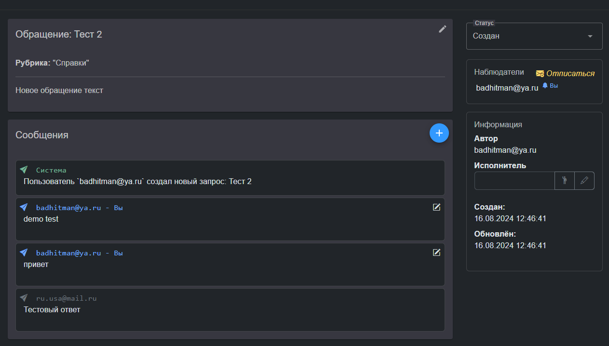
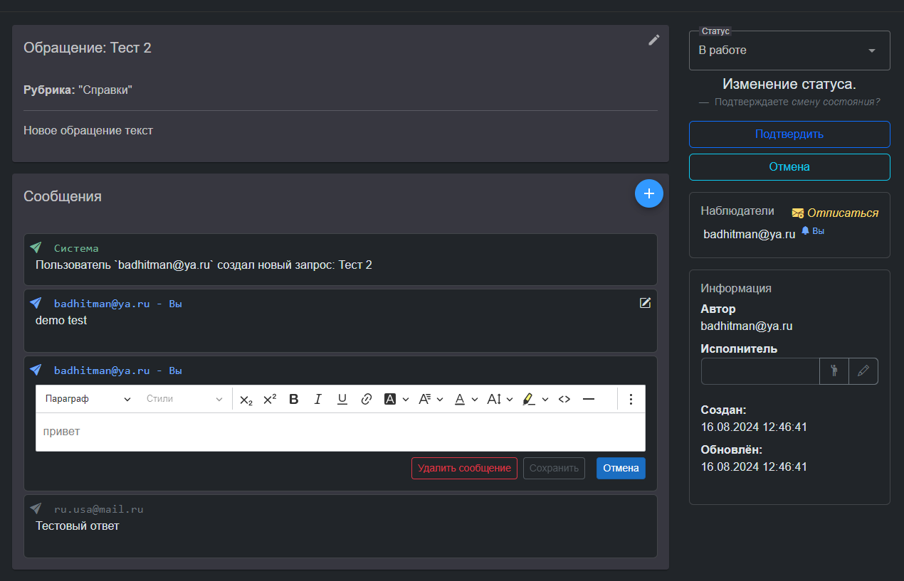

### TelegramBot
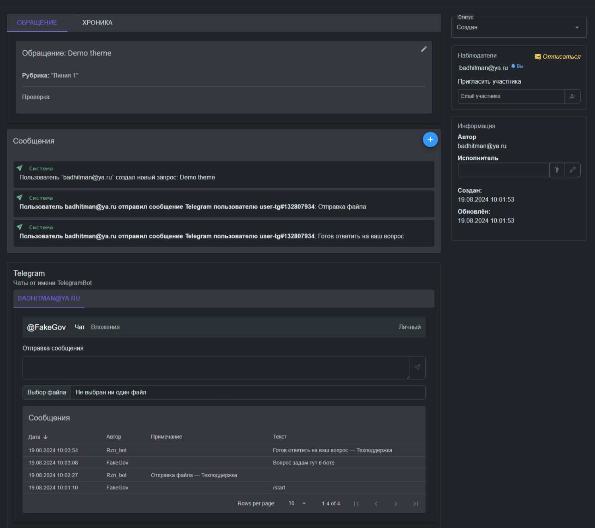

Все участники (у которых привязан Telegram) доступны в области **TelegramBot** чатов. Можно сразу вести переписку с клиентом (даже с исполнителем или подписчиком) напрямую от имени бота - отправленные тут сообщения регистрируются = попадают в хронику обращения и добавляется как комментарий к обращению от имени системной учётной записи. В этот перечень чатов попадают все пользователи, связанные с данным обращением: подписчики, автор, исполнитель. Если в обращении не окажется ни одного пользователя с подтверждённым Telegram, тогда эта область не отобразится совсем.
Двусторонняя поддержка отправки/приёмки файлов: отправленные клиентом боту файлы доступны в консоли так же как и отправка файлов клиенту от имени бота.

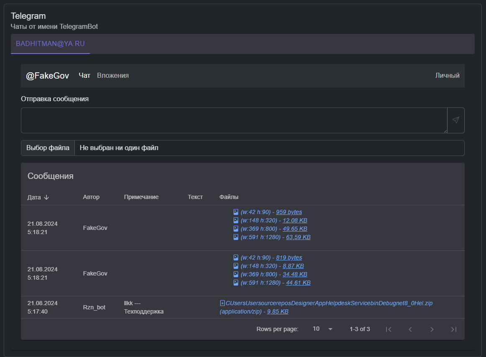

### Чаты TelegramBot
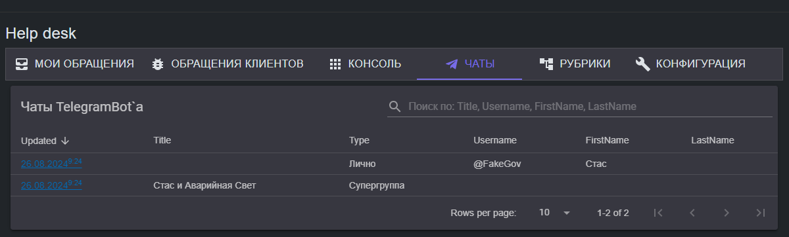

Любой чат можно открыть и начать переписку с клиентом от имени бота или посмотреть обращения, связанные с чатом:

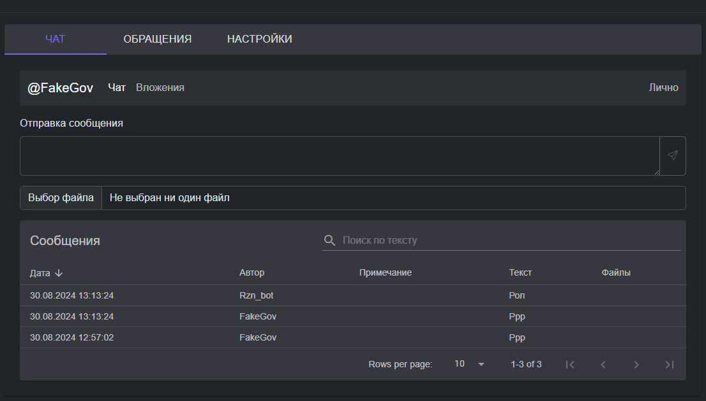

Журнал клиента тот же самый, что и ваш личный, но от имени выбранного чата. Вы можете самостоятельно создавать обращения от имени клиента, где он будет автор.

### События (SLA)
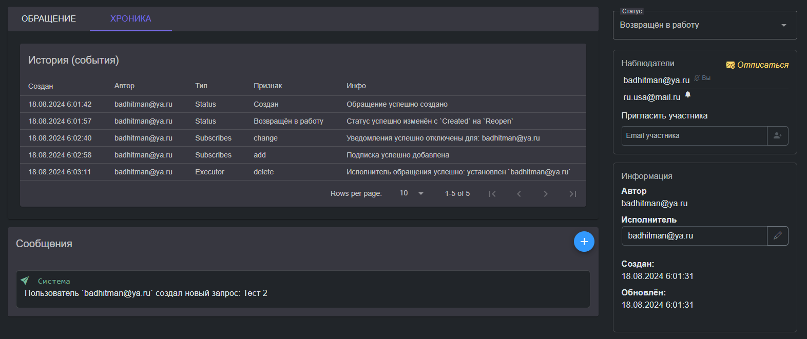

История всех изменений в хронологическом порядке. В последствии эти записи позволят извлекать SLA аналитику. Кроме того в [службе регистрации событий](/HelpdeskService/Services/Receives/issues/pulse/PulseIssueReceive.cs) размещён механизм рассылки уведомлений подписчикам, что позволит устроить гибкую/настраиваемую подсистему подписок на уведомления.

## Настройки
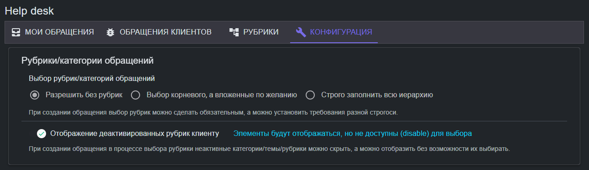

Для начала следует настроить работу выбора рубрик/категорий и ввести эти категории в [соответствующем разделе](https://github.com/badhitman/DesignerApp/tree/main/HelpdeskService#%D1%80%D1%83%D0%B1%D1%80%D0%B8%D0%BA%D0%B8).

### Командный режим TelegramBot
Если вы не предусмотрели свой специализированный обработчик входящих сообщений в TelegramBot, тогда включите командный режим:

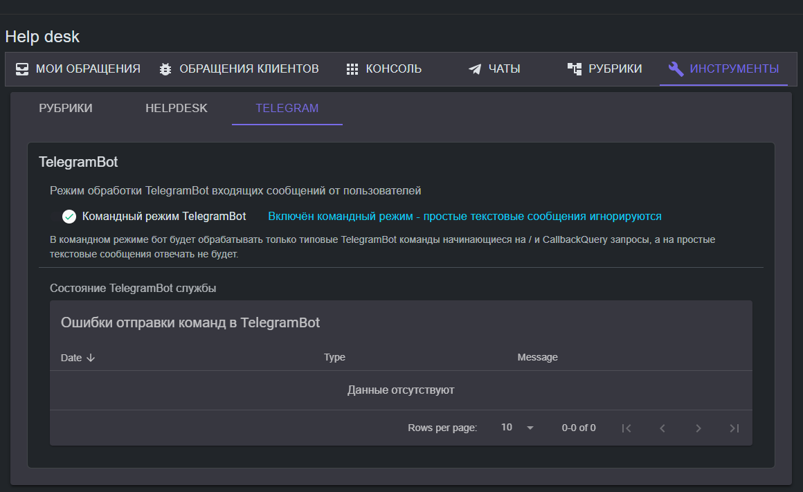

Это параметр не **HelpDesk**, а именно бота. Таким образом бот перестанет обрабатывает простые текстовые сообщения от пользователей. В этом режиме простые текстовые сообщения в бота не обрабатываются автоответчиком (равно как и отправленные файлы, документы и т.п.). Сообщения сохраняются, но ответ не формируется если это не команда или **CallbackQuery**. Команды в TelegramBot начинаются с косой черты (/). Таким образом в командном режиме бот будет пытаться выполнить/бработать входящее сообщение только если текст сообщения является командой: начинается с косой черты (/) либо в случае если это **CallbackQuery**, а в остальных случаях клиент будет в свободной форме вести чат с ботом, а сотрудники **HelpDesk** должны будут ему отвечать от имени бота через консоль или воспользовавшись *'экспресс-ответом в чате'*.

#### Переадресация Telegram (глобально)
Следует указать чат в который будут переадресованы сообщения от новых клиентов, т.е. от тех клиентов, на которых ни кто из сотрудников не подписан. Клиентам можно устанавливать [переадресации на группы или на персональные чаты сотрудников](https://github.com/badhitman/DesignerApp/tree/main/HelpdeskService#telegrambot-%D1%83%D0%B2%D0%B5%D0%B4%D0%BE%D0%BC%D0%BB%D0%B5%D0%BD%D0%B8%D1%8F-%D0%BF%D0%B5%D1%80%D0%B5%D1%81%D1%8B%D0%BB%D0%BA%D0%B0-%D1%81%D0%BE%D0%BE%D0%B1%D1%89%D0%B5%D0%BD%D0%B8%D0%B9-%D0%BA%D0%BB%D0%B8%D0%B5%D0%BD%D1%82%D0%BE%D0%B2), но если в бота написал клиент без активной подписки, такие сообщения пересылаются например в общий чат первой линии поддержки.

В общем чате как и в персональных (для клиента) возможен [экспресс-ответ](https://github.com/badhitman/DesignerApp/tree/main/HelpdeskService#%D1%8D%D0%BA%D1%81%D0%BF%D1%80%D0%B5%D1%81%D1%81-%D0%BE%D1%82%D0%B2%D0%B5%D1%82%D1%8B).