## Конструктор документов (*стадия активной разработки*).
> как развитие базового кейса '*Blazor NET.8 + TelegramBot*' из ветки [main](https://github.com/badhitman/DesignerApp/tree/main). Другими словами там уже есть встроенная поддержка TelegramBot и другие нюансы решения из основной ветки.

**Constructor** - гибкое web решение для конструирования документов, справочников и т.п.

... добавлено [разного UI на Blazor](https://github.com/badhitman/DesignerApp/tree/constructor/BlazorServerLib/Components/Forms). А так же [немного](https://github.com/badhitman/DesignerApp/blob/constructor/DBContextLibs/DbLayerLib/ConstructorLayerContext.cs) [БД](https://github.com/badhitman/DesignerApp/tree/constructor/SharedLib/Models/db/forms) для [соответствующего сервиса](https://github.com/badhitman/DesignerApp/blob/constructor/SharedLib/IServices/main/IFormsService.cs).

### Проекты
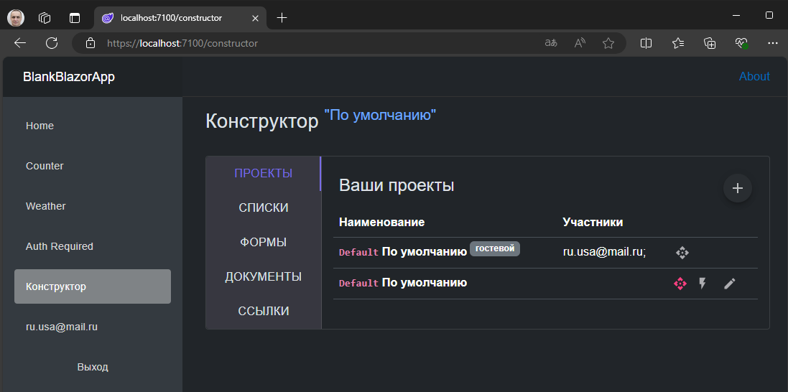
проекты могут быть как свои так и гостевые. Гостевые - это те, которые были созданы другими пользователями, а вас туда добавили как участников. 

Гостевые проекты нельзя редактировать или включать/выключать, но их можно использовать: сделать основным/действующим. Когда вы задействуете какой-либо проект в роли основного - ваш контекст конструктора переключается на него. Все работы в конструкторе всегда принадлежат какому-то одному проекту, а все участники вместе с владельцем работают в едином общем пространстве имея доступ друг к другу. Если создатель/владелец выключит свой проект - дальнейшее редактирование участниками сущностей в этом проекте становится невозможным. Выданные ссылки по прежнему доступны пользователям. Отключение проекта блокирует только возможность вносить изменения в списки/справочники, формы и документы. Любые изменения в сущностях проекта незамедлительно отражаются во всех ссылках, которые связаны с документом.

### Справочники (перечисления)
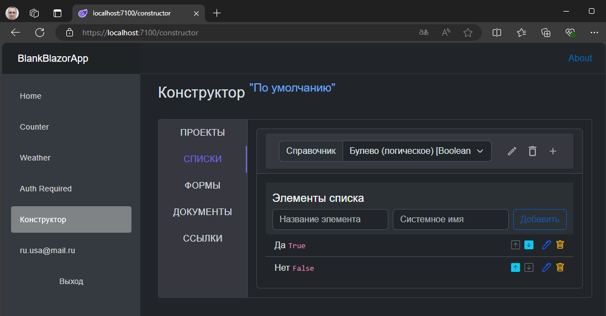
простейшая бизнес-модель (управляемая сущность). По смыслу это обычное перечисление - именованный список простейших строк. Примером такой структуры может быть `пол человека`: `муж`, `жен`; или `способ связи`: `телефон`, `email`; Для подобных ситуаций используется этот вид конструктора. В последствии эти справочники можно будет указать как тип поля формы, а клиент в свою очередь сможет им воспользоваться как обычным селектором.

в ограниченном режиме: *если владелец деактивировал проект*
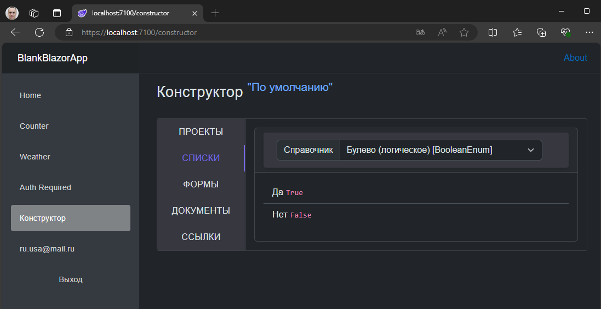
списки по прежнему доступны, но редактировать их сможет либо владелец либо администратор.

### Формы
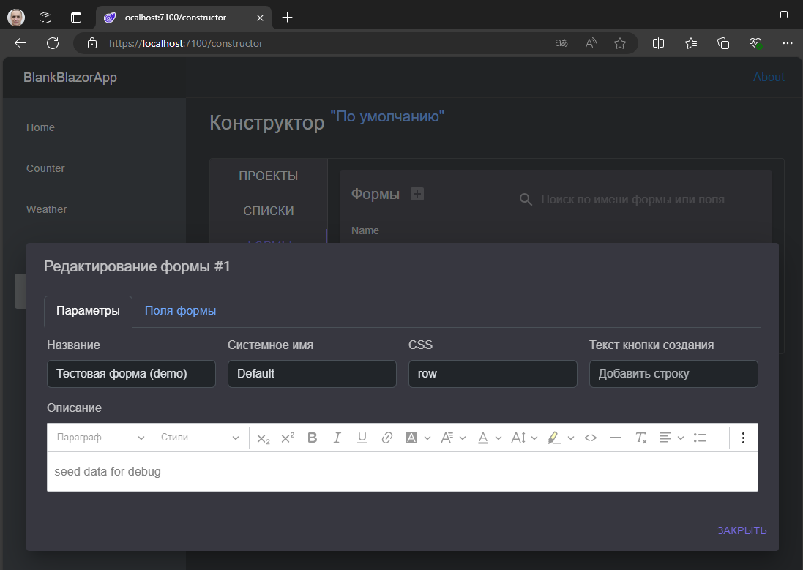
форме как и полям формы можно указывать CSS стили, что бы воспользоваться Bootstrap вёрсткой.

Доступные типы полей формы
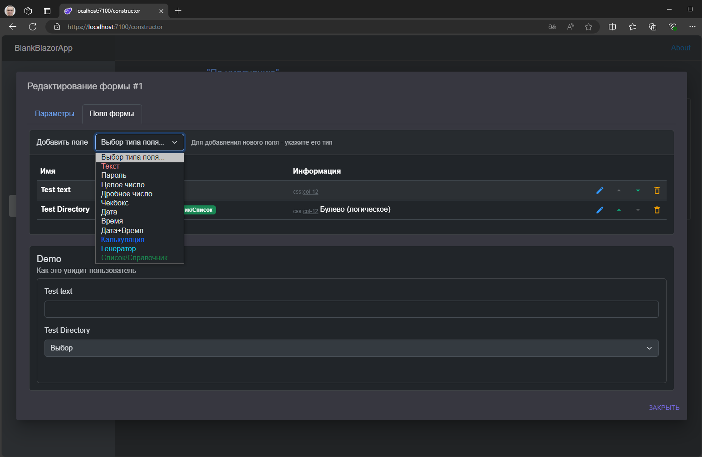
Добавляя поле на форму можно воспользоваться одним из доступных типов данных. Там же есть тип `Список/Справочник` для того что бы задействовать свой собственный список.

Перечень полей формы
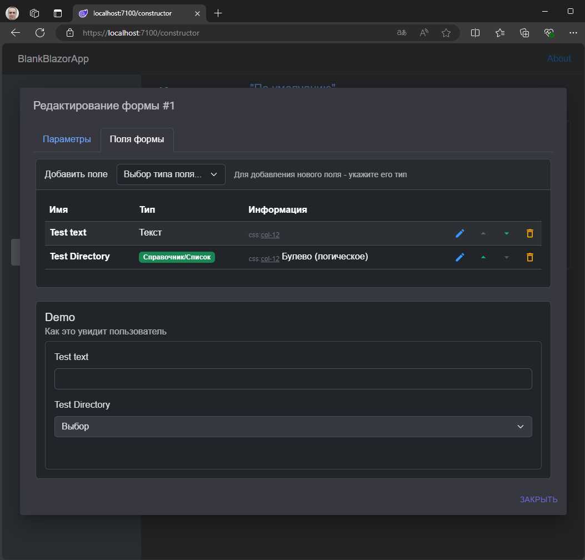
видно сразу результат настроек полей формы. внизу отображается область **Demo** *Как это увидит пользователь*.

в ограниченном режиме (если проект деактивирован владельцем)
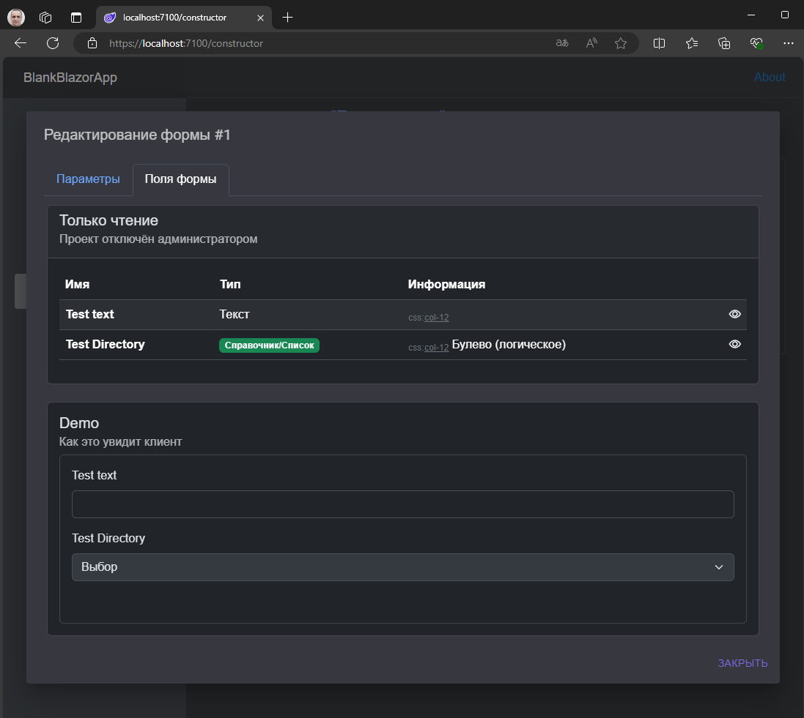

Редактирование поля формы

поле формы как и форма имеет свойство CSS стилей, что в комплексе с используемым Bootstrap позволяет управлять вёрсткой формы.

в случае выключено проекта форма доступна только для просмотра

### Документы (схема)
Конечный результат конструирования. Тут указывается количество табов/вкладок и их состав.
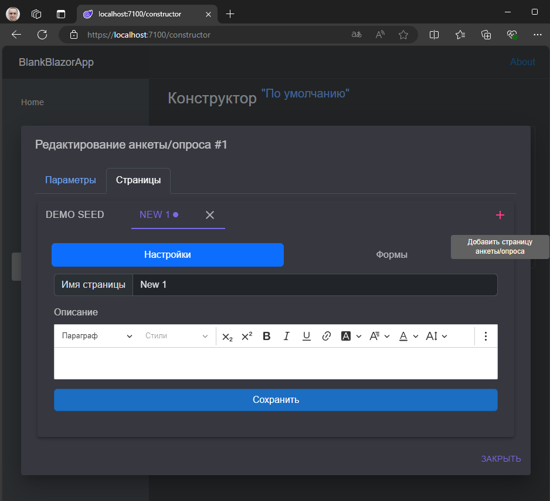
в финале конструируется схема документа. Документ имеет вкладки/табы похожие на те что существуют в Excel. Это позволяет разделить сложные документы на разные области, где каждая будет содержать свой набор форм и настройки.

На каждую из вкладок/табов можно добавить свой набор форм.
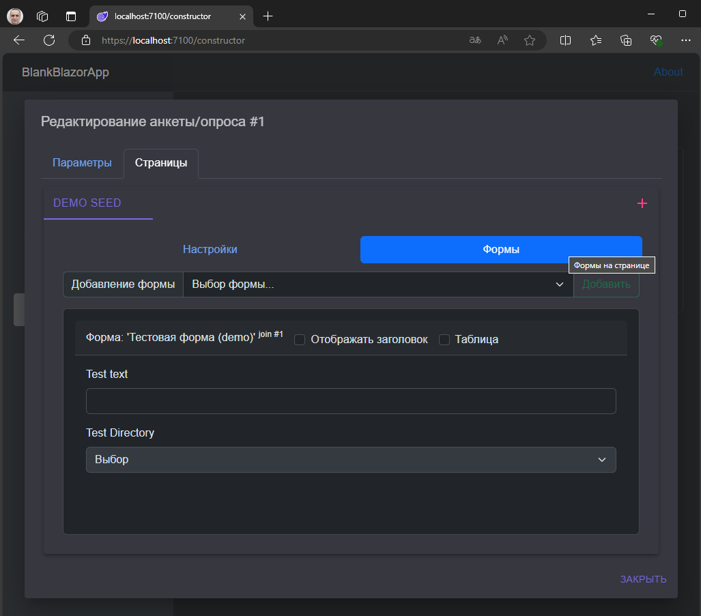

### Ссылки/сессии
по ссылке пользователю доступна форма для заполнения
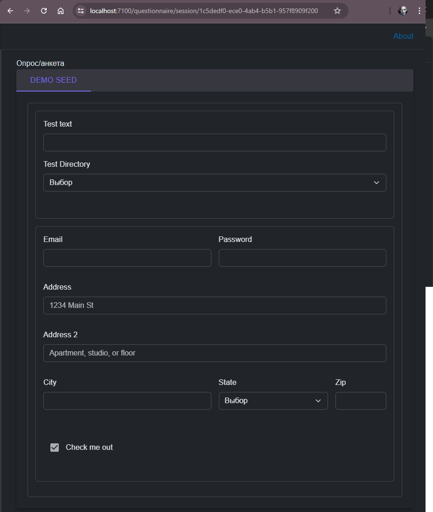
в данном случае документ содержит одну вкладку, но их может быть сколько угодно и на каждой вкладке любое количество любых форм

созданные ссылки в текущем проекте
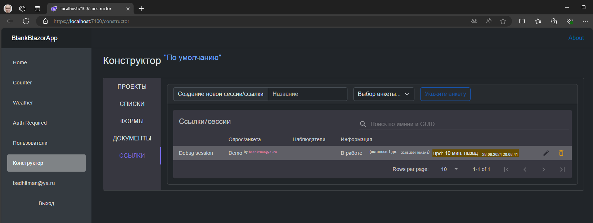

управление сессией/ссылкой
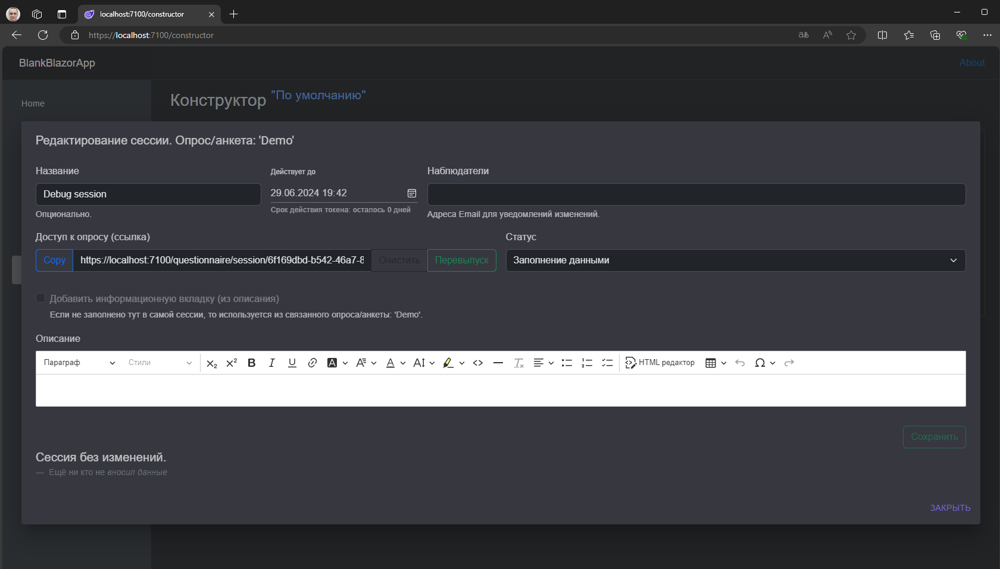

