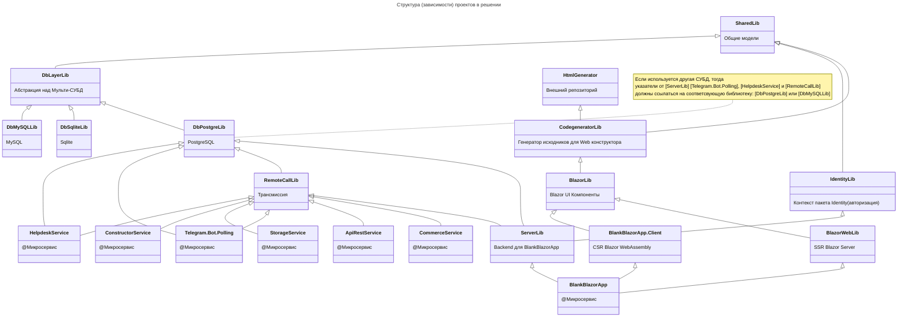
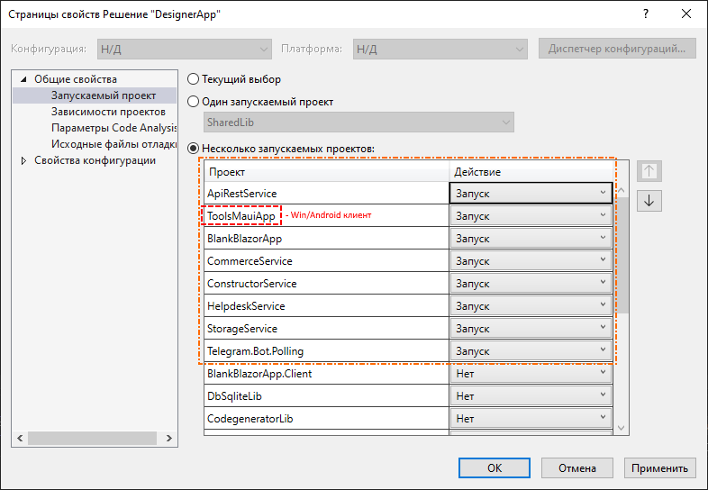
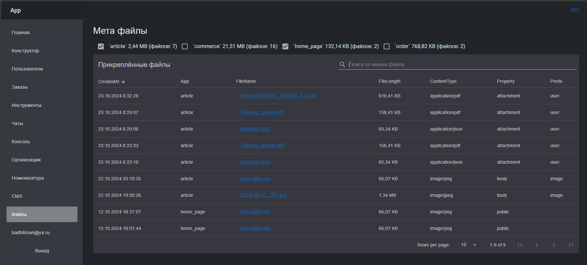

## Blazor NET.8 + Telegram Bot + СЭД (HelpDesk/ServiceDesk)

- **Blazor NET.8**[^4] + **TelegramBot**[^5]: подойдёт как стартовый кейс web решения с поддержкой **Telegram бота**.
- Связь между службами через RabbitMQ[^1] в режиме `запрос-ответ`: при отправке сообщения в очередь, отправитель дожидается ответ (в границах таймаута) и возвращает результат вызывающему. При использовании вызова такой команды удалённого сервиса проходит так, как если бы это был обычный `await` запрос к базе данных или rest/api.
- ServiceDesk/HelpDesk подсистема оказания консультаций и обратной связи. Пользовательский доступ возможен прямо из Telegram (WebApp) без ввода логина/пароля и вообще регистрации. Управление документами: изменение статусов заявок, журналирование/протоколирование событий и другая универсальная функциональность.
- Подсистема электронной коммерции: на базе СЭД функционирует простой учёт заказов.
- WEB-Конструктор схем данных (формы, документы).
- Интерфейс rest API (swagger) для внешних информационных систем (план обмена для [commerce](https://github.com/badhitman/DesignerApp/blob/main/CommerceService/INTEGRATION.md)).
- ui пакеты: [MudBlazor 7](https://github.com/MudBlazor/MudBlazor/) и два WYSIWYG: [CKEditor](https://ckeditor.com/) и [TinyMCE](https://www.tiny.cloud). Важно: **CKEditor** не поддерживает вставку картинок, а **TinyMCE** имеет такую поддержу (в т.ч. локальное хранение файлов в MongoDB)

Зависимости решения между проектами (в формате [Mermaid](https://mermaid.js.org)):



### Службы (активные/запускаемые):
Пример того как может быть настроено в VS:


#### [Telegram.Bot.Polling](https://github.com/badhitman/DesignerApp/tree/main/Telegram.Bot.Polling) 
- Сохраняет все входящие сообщения и позволяет в последствии работать с чатами другим сервисам.
- В оригинальном исполнении `Worker Service`[^5].
- Ответы на входящие Telegram сообщения обрабатывает реализация интерфейса `ITelegramDialogService`[^7]. Пользователям можно индивидуально устанавливать имя автоответчика[^2]. Это касается как простых текстовых `Message`, так и `CallbackQuery`.
- Для обеспечения работы HelpDesk предусмотрен [командный режим работы бота](https://github.com/badhitman/DesignerApp/tree/main/HelpdeskService#%D0%BA%D0%BE%D0%BC%D0%B0%D0%BD%D0%B4%D0%BD%D1%8B%D0%B9-%D1%80%D0%B5%D0%B6%D0%B8%D0%BC-telegrambot). В этом режиме простые текстовые сообщения в бота не обрабатываются автоответчиком (равно как и отправка файлов, документов и т.п.). Сообщения сохраняются, но ответ не формируется если это не команда или **CallbackQuery**. Команды в TelegramBot начинаются с косой черты (/). Таким образом в командном режиме бот будет пытаться выполнить/обработать входящее сообщение только если текст сообщения является командой: начинается с косой черты (/) либо в случае если это **CallbackQuery**, а в остальных случаях клиент будет в свободной форме вести чат с ботом, а операторы HelpDesk должны будут ему отвечать от имени бота через WEB интерфейс или воспользовавшись режимом ['экспресс-ответа'](https://github.com/badhitman/DesignerApp/tree/main/HelpdeskService#%D1%8D%D0%BA%D1%81%D0%BF%D1%80%D0%B5%D1%81%D1%81-%D0%BE%D1%82%D0%B2%D0%B5%D1%82%D1%8B).

#### [BlankBlazorApp](https://github.com/badhitman/DesignerApp/tree/main/BlankBlazorApp/BlankBlazorApp)
- Blazor вэб сервер.
- Рендеринг: `InteractiveServerRenderMode(prerender: false)`
- Авторизация типовая `Microsoft.AspNetCore.Identity` ([documents](https://learn.microsoft.com/ru-ru/aspnet/core/security/authentication/identity?view=aspnetcore-8.0&tabs=visual-studio)).
- В Frontend добавлен базовый функционал для работы с Пользователями, Ролями, Claims и Telegram[^4]. 
- Служба равно как и другие службы использует RabbitMQ для обслуживания входящих команд, на которые она зарегистрировала свои обработчики[^1]. Кроме того, Web служба обрабатывает запросы для [Identity](https://learn.microsoft.com/ru-ru/aspnet/core/security/authentication/identity?view=aspnetcore-8.0&tabs=visual-studio). У Identity свой автономный контекст БД.

#### [HelpdeskService](https://github.com/badhitman/DesignerApp/tree/main/HelpdeskService) 
- Система документооборота со своим собственным контекстом: `HelpdeskContext`.
- Смена статуса документу. Исполнитель. SLA. Базовый набор работы с документами.
- Готовый инструмент обработки обращений в формате HelpDesk\ServiceDesk.
- используется сервисом `CommerceService` для 'ведения заказа'.

#### [StorageService](https://github.com/badhitman/DesignerApp/tree/main/StorageService)
- Общее пространство хранения параметров со своим контекстом: `StorageContext`. Позволяет разным службам обращаться к параметрам друг друга. Например в Web интерфейсе HelpDesk можно изменить режим работы TelegramBot (бот читает этот параметр при каждом входящем сообщении).
- Тэги. Общая система тегов для прикладных объектов.
- Обслуживает [функционал хранения файлов](./#%D1%85%D1%80%D0%B0%D0%BD%D0%B5%D0%BD%D0%B8%D0%B5-%D1%84%D0%B0%D0%B9%D0%BB%D0%BE%D0%B2): MongoDB.Driver.GridFS

#### [CommerceService](https://github.com/badhitman/DesignerApp/tree/main/CommerceService)
- Справочник номенклатуры и офферов с настраиваемыми правилами ценообразования. Клиенты ведут свой перечень юридических лиц с разбивкой по филиалам, для которых можно формировать заказы. Документы после создания сразу попадают в основную СЭД, где с ними можно работать: менять статус, вести диалог с клиентом и т.д.

#### [ApiRestService](https://github.com/badhitman/DesignerApp/tree/main/ApiRestService)
- Упрощённая авторизация: использование постоянного токена в заголовке запроса (ключ доступа). Служба выступает в роли посредника между внутренним контуром и внешними потребителями. Например для обмена с 1С.

#### [ConstructorService](https://github.com/badhitman/DesignerApp/tree/main/ConstructorService)
- Решение для создания форм и документов. В режиме WEB редактора можно создать документ любой сложности (поля, формы, табы, таблицы) и использовать эти схемы для создания сессий (уникальные ссылки) которые можно передавать пользователям. По таким ссылкам/сессиям пользователь увидит созданный документ что бы заполнить его данными.

> все службы должны быть настроены, запущены вместе и соединены общим RabbitMQ и Redis. В противном случае в MQ очередях будут копиться запросы без ответов и функционал местами будет недоступен если ответственная служба не будет обрабатывать запросы.

### Хранение файлов
Файлы, встречающиеся в системе могут быть в одном из двух состояний:
- Telegram cloud: если в Telegram сообщениях фигурируют вложения (файлы), ссылки на скачивание из TG сохраняются в базе данных (но не сами данные). При попытке пользователем скачать такой файл происходит online скачивание данных с серверов TG. Эти данные не сохраняются ни где в системе, а доступны только режиме онлайн из TG.
- МетаФайлы (локальное хранилище)[^10]: файлы хранятся `MongoDB.Driver.GridFS`. О каждом таком файле в базе данных дополнительно существуют метаданные. Эти файлы не связаны с прикладными объектами системы на логическом уровне СУБД, но по их мета-данным можно определить что это за файл и к чему он относится. В метаданных два обязательных параметра `ApplicationName` и `PropertyName` и три не обязательных: `PrefixPropertyName`, `OwnerPrimaryKey`, `Referrer`. Кроме того: этим файлам можно назначать произвольные Теги и установить ограничения доступа к файлу[^10]..

#### Логирование (Nlog)
Nlog пишет одновременно: в текстовый файл и в базу данных (`PostgreSQL`). Строка подключения к БД находится в конфигах 'nlog.config' - отредактируйте под свои параметры. Строка подключения по умолчанию (для всех сервисов): `Server=localhost;Port=5432;User Id=nlog;Password=nlog;Database=nlogs;`

Пример скрипта 'PostgreSQL' для создания базы данных логов:
``` sql
CREATE TABLE public.logs
(
    "Id" integer GENERATED ALWAYS AS IDENTITY NOT NULL,
    "Application" character(256),
    "Timestamp" timestamp without time zone NOT NULL,
    "Level" character(128) NOT NULL,
    "Message" varchar,
    "Logger" character(256),
    "Callsite" character(256),
    "Exception" varchar,
    CONSTRAINT logs_pk PRIMARY KEY ("Id")
);

ALTER TABLE IF EXISTS public.logs
    OWNER to nlog;
```

### NGINX - Максимальный размер пакета
Для функционирования утилиты (win/android) в части синхронизации папок с целью доставки сборок на сервер потребуется предусмотреть максимальный размер тела был не меньше 10 мегабайт.
- Конфигурацию можно проверить/изменить например тут: `/etc/nginx/nginx.conf`.
- Параметр: `client_max_body_size 10M;`
- После изменения нужно перезагрузить службу: `systemctl restart nginx`

### Настройка
- Перед запуском: в Blazor[^4] потребуются конфиги **Email** (отправка писем **SMTP**. в. т.ч. для **Identity**), а для **TelegramBot** потребуется токен. **MQ** и **Redis** настройки потребуются всем сервисам (единый контекст для всех сервисов). База данных может быть как SQLite, так и PostgreSQL/MySQL (у каждого сервиса своя БД). **MongoDB** потребуется для `StorageService`.
- Помимо стандартных настроек **appsettings.json** потребуется отдельная папка где будут храниться приватные данные: логины и пароли к внешним системам. В всех службах поиск/загрузка секретов происходит одинаково:
```C#
// Secrets
string secretPath = Path.Combine("..", "secrets");
for (int i = 0; i < 5 && !Directory.Exists(secretPath); i++)
  secretPath = Path.Combine("..", secretPath);
if (Directory.Exists(secretPath))
  foreach (string secret in Directory.GetFiles(secretPath, $"*.json"))
    configHost.AddJsonFile(Path.GetFullPath(secret), optional: true, reloadOnChange: true);
else
  logger.Warn("Секреты не найдены");
```
Приложение ищет папку с именем `secret` на уровне выше текущей директории приложения, а если не находит нужной папки, то пытается искать её ещё выше и выше в иерархии папок пути относительно исполняемого файла пока не найдёт её. На этапе разработки эти файлы могут лежать например тут: C:\Users\ _ИмяПользователя_ \source\repos\secrets или выше в иерархии папок.

В папке секретов `secrets` предполагается наличие следующих настроек (одним *.json файлом или разными это не важно. загрузятся все *.json файлы из папки секретов):

- RabbitMQ подключение потребуется для всех четырёх служб (**Telegram.Bot.Polling** и **BlazorWebApp**):
```json
{
  "RabbitMQConfig": {
    "UserName": "ваш_логин_от_rabbitmq",
    "Password": "ваш_пароль_от_rabbitmq",
    "VirtualHost": "/"
  }
}
```

- Email (SMTP) потребуется только для службы **BlazorWebApp** (*В том числе для отправки уведомлений подсистемой авторизации* `Microsoft.AspNetCore.Identity`):
```json
{
  "SmtpConfig": {
    "Email": "ваш-email@домен",
    "Login": "логин-для-smtp",
    "Password": "ваш-пароль-для-smtp",
    "Host": "smtp-адрес-хоста",
    "Port": 465
  }
}
```
Если отправка Email происходит иначе чем обычный SMTP, тогда следует реализовать `IMailProviderService` под условия и предусмотреть соответствующие настройки.

- MongoDB:
```json
{
  "MongoDB": {
    "Sheme": "mongodb",
    "Host": "localhost",
    "Port": 27017,
    "Login": "",
    "Password": ""
  }
}
```
Используется для хранения файлов (вложения в документы и т.п.)

- Токен **TelegramBot** нужен только для соответствующей службы `Telegram.Bot.Polling`:
```json
{
  "BotConfiguration": {
    "BotToken": "ваш-токен-для-бота"
  }
}
```
Создать бота и получить свой токен можно у [@BotFather](https://t.me/BotFather)

### Роль Admin (полные права) можно назначить через *.json конфигурацию
У службы `BlazorWebApp` можно настроить Email адреса клиентов таким образом, что бы закрепить за ними любые произвольные роли. Это полезно, для первого старта приложения: администратор прописывает свой Email под которым он будет авторизовываться с необходимой ему ролью `admin`, тогда при каждом входе будут проверяться наличие требуемой роли у пользователя. Если необходимых ролей не окажется в системе, то они будут автоматически созданы. Клиент обязательно получит роли, которые ему были прописаны в конфигурации. Пример настроек:
```json
{
  "UserManage": {
    "UpdatesUsersRoles": [
      {
        "EmailUser": "ваш_email@сайт.ru",
        "SetRoles": [ "admin" ]
      },
      {
        "EmailUser": "другой_email@домен.com",
        "SetRoles": [ "manager" ]
      }
    ]
  }
}
```
прописать можно любые роли любым клиентам. после этого им нужно залогиниться - нужные роли обязательно окажутся у клиента. после того как требуемые роли назначены - эти настройки рекомендуется удалить. наличие таких конфигов делает невозможными попытки лишить пользователей этих ролей в связи с тем что они будут проверяться и выдаваться при каждом входе клиента.

### Tools (maui app)
Windows/Android [утилита для удалённого взаимодействия с сервисами](https://github.com/badhitman/DesignerApp/tree/main/ToolsMauiApp). Работает через штатный [rest/api](https://github.com/badhitman/DesignerApp/tree/main/ApiRestService):
- Синхронизация (односторонняя) папок локальной (win/android) с удалённой (на сайте). Сверка файлов производится по имени, размеру и md5:hash файла. На сервер будут доставлены только новые или изменённые файлы, а недостающие будут удалены: локальная папка устройства будет спроецирована/клонирована в папку на сайте.
- Удалённый вызов команд (shell/cmd)

[^1]: Подробнее про реализацию MQ транспорта можно узнать [тут](https://github.com/badhitman/DesignerApp/tree/main/RemoteCallLib).

[^2]: Имя обработчика ответов храниться в [контексте пользователя](https://github.com/badhitman/DesignerApp/blob/main/SharedLib/Models/TelegramUserBaseModelDb.cs#L45). Подробнее [тут](https://github.com/badhitman/DesignerApp/tree/main/Telegram.Bot.Polling#telegrambot-%D0%B4%D0%B8%D0%B0%D0%BB%D0%BE%D0%B3%D0%B8)

[^4]: Стандартная ASP служба [Blazor WebApp](https://github.com/badhitman/DesignerApp/tree/main/BlankBlazorApp/BlankBlazorApp). За основу взята [эта работа](https://github.com/dotnet/blazor-samples/tree/175634ec31942b181f211008e8841c26e91f33e5/8.0/BlazorWebAssemblyStandaloneWithIdentity).

[^5]: WorkerService служба [Telegram.Bot.Polling](https://github.com/badhitman/DesignerApp/tree/main/Telegram.Bot.Polling) сделана на основе [Telegram.Bot.Examples.Polling](https://github.com/TelegramBots/Telegram.Bot.Examples/tree/d7dd05e12ae97c5949804b465a8a87e3f894c3f2/Telegram.Bot.Examples.Polling).

[^6]: Про переключение контекста между разными СУБД можно узнать [тут](https://github.com/badhitman/DesignerApp/tree/main/DBContextLibs).

[^7]: Свой обработчик ответа на входящее сообщение Telegram реализуется через [интерфейс](https://github.com/badhitman/DesignerApp/blob/main/SharedLib/IServices/ITelegramDialogService.cs) и [регистрации его в **Program.cs**](https://github.com/badhitman/DesignerApp/blob/main/Telegram.Bot.Polling/Program.cs#L84) службы **TelegramBot**.

[^8]: Служба Telegram бота для каждого входящего сообщения [проверяет статус пользователя через вызов удалённой команды](https://github.com/badhitman/DesignerApp/blob/main/Telegram.Bot.Polling/Services/UpdateHandler.cs#L53), которую в данном случае обрабатывает Web сервер Blzaor.

[^9]: [Бот ищет по имени нужного обработчика. Если не находит, то использует базовый](https://github.com/badhitman/DesignerApp/blob/main/Telegram.Bot.Polling/Services/UpdateHandler.cs#L131).

[^10]: МетаФайлы поддерживают контроль доступа. По умолчанию файлы доступны публично по ссылке, но можно установить ограничения на чтение. Правила доступа позволяют разрешать доступ персонально пользователям или по ассоциации с документом. В случае доступа по ассоциации с документом проверяется упоминание пользователя в документе (должен быть среди подписчиков или являться автором|исполнителем). Кроме того можно создать токен доступа (guid) для файла, по которому можно получить доступ вне всяких ограничений передав его get/query параметром в строке URL.