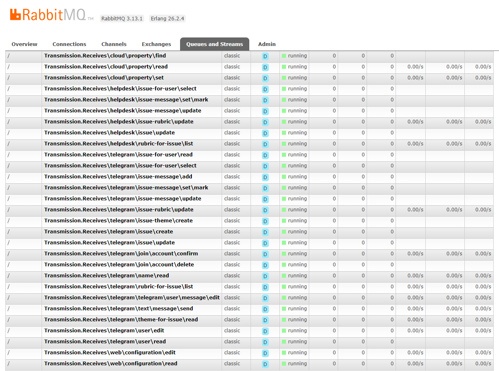
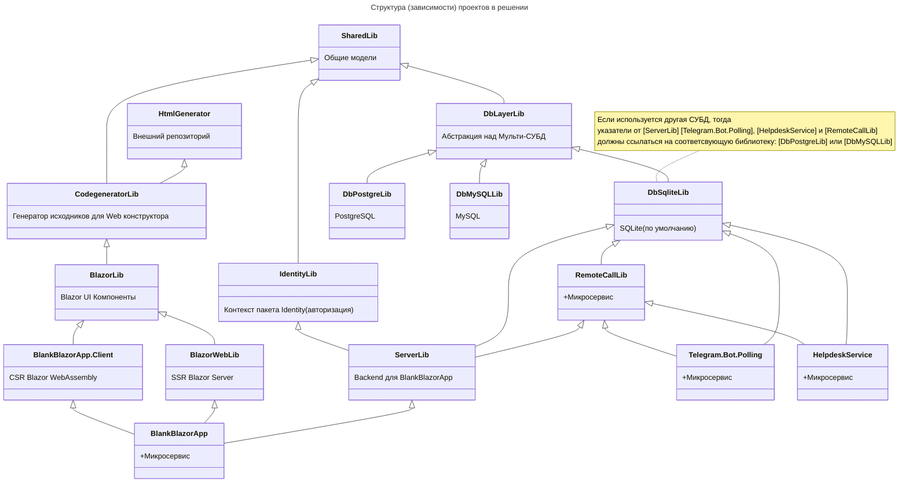
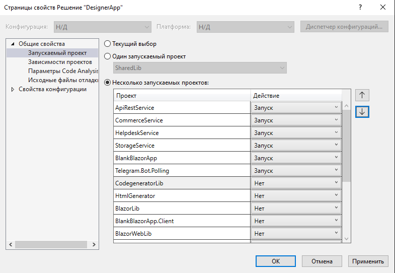

## Blazor NET.8 TelegramBot HelpDesk 
#### + [web forms constructor](CONSTRUCTOR.md)

- **Blazor NET.8**[^4] + **TelegramBot**[^5]: подойдёт как стартовый кейс web решения с поддержкой **Telegram бота**.

- Базы данных (по умолчанию) [SQLite](https://github.com/badhitman/DesignerApp/tree/main/DBContextLibs#sqlite-установлен-по-умолчанию): миграции отсутствуют, поскольку изначально не понятно какая в итоге СУБД будет выбрана[^10]. Для переключения с **SQLite** на [PostgreSQL](https://github.com/badhitman/DesignerApp/tree/main/DBContextLibs#postgresql) или [MySQL](https://github.com/badhitman/DesignerApp/tree/main/DBContextLibs#mysql): потребуется отредактировать зависимости проектов[^6]. После того как определились с используемой СУБД (*или оставили как есть*: **SQLIte**) - можно использовать миграции [^10]. Если после обновления ветки у вас возникли ошибки уровня БД, то, вероятно, сменилась схема базы. Если вы не ведёте миграции самостоятельно, тогда при каждом изменении схемы БД старую (текущую) базу требуется удалить вручную (СУБД по умолчанию: SqLite) и создать заново [(команды подготовлены)](https://github.com/badhitman/DesignerApp/blob/main/DBContextLibs/DbSqliteLib/migrations.md) (для других контекстов команды находятся в  папках, соответствующих нужной СУБД, + Identity имеет собственный контекст). После выхода в релиз задействуются полноценные миграции. Всего 5 контекстов БД: `IdentityAppDbContext`, `MainDbAppContext`, `CloudParametersContext`, `HelpdeskContext`, `TelegramBotContext`.

- Связь между службами реализована через RabbitMQ[^1] в режиме `запрос-ответ`: при отправке сообщения в очередь, отправитель дожидается ответ (в границах таймаута) и возвращает результат вызывающему. При использовании вызова такой команды удалённого сервиса проходит так, как если бы это был обычный `await` запрос к базе данных или rest/api.

- Установлен/используется пакет [MudBlazor 7](https://github.com/MudBlazor/MudBlazor/)

- HelpDesk [система оказания консультаций](https://github.com/badhitman/DesignerApp/tree/main/HelpdeskService) и обратной связи. Пользовательский доступ возможен прямо из Telegram (WebApp) без ввода логина/пароля и вообще регистрации.

> [!IMPORTANT]
> В принципе служба *TelegramBot* могла бы использовать прямой доступ к сервисам как это делает `BlazorWebApp` (достаточно установить зависимость от `ServerLib`), тогда `RemoteCallLib` становится бесполезным и его можно даже удалить (+ заменить зависимости сервисов на серверные). Но в данной реализации *Telegram* бот не связан с серверной инфраструктурой (нет доступа ни к БД сервера ни даже к его DI сервисам), а только отправляет запросы в RabbitMQ и получает ответы в виде `public class TResponseModel<TResponse> : ResponseBaseModel`, который поддерживает наличие статусных сообщений.

Зависимости решения между проектами (в режиме СУБД SQLite):



### Службы (активные/запускаемые):
Пример того как может быть настроено в VS:

#### 1. TelegramBot
[Telegram.Bot.Polling](https://github.com/badhitman/DesignerApp/tree/main/Telegram.Bot.Polling) - сохраняет все входящие сообщения и позволяет в последствии работать с чатами HelpDesk или другим сервисам решения.

- В оригинальном исполнении `Worker Service`[^5].
- Ответы на входящие Telegram сообщения обрабатывает реализация интерфейса `ITelegramDialogService`[^7]. Пользователям можно индивидуально устанавливать имя автоответчика[^2]. Это касается как простых текстовых `Message`, так и `CallbackQuery`.
- Через RabbitMQ служба получает команды от внешних систем, выполняет их, а результат возвращает ответом отправителю (*например команда*: отправка сообщения Telegram клиенту от имени бота)[^1].
- Для обеспечения комфортной работы HelpDesk предусмотрен [командный режим работы бота](https://github.com/badhitman/DesignerApp/tree/main/HelpdeskService#%D0%BA%D0%BE%D0%BC%D0%B0%D0%BD%D0%B4%D0%BD%D1%8B%D0%B9-%D1%80%D0%B5%D0%B6%D0%B8%D0%BC-telegrambot). В этом режиме простые текстовые сообщения в бота не обрабатываются автоответчиком (равно как и отправка файлов, документов и т.п.). Сообщения сохраняются, но ответ не формируется если это не команда или **CallbackQuery**. Команды в TelegramBot начинаются с косой черты (/). Таким образом в командном режиме бот будет пытаться выполнить/бработать входящее сообщение только если текст сообщения является командой: начинается с косой черты (/) либо в случае если это **CallbackQuery**, а в остальных случаях клиент будет в свободной форме вести чат с ботом, а сотрудники HelpDesk должны будут ему отвечать от имени бота через консоль.

#### 2. WEB: BlazorWebApp
[BlankBlazorApp](https://github.com/badhitman/DesignerApp/tree/main/BlankBlazorApp/BlankBlazorApp) - Blazor вэб сервер.
- Рендеринг: `InteractiveServerRenderMode(prerender: false)`
- Авторизация типовая `Microsoft.AspNetCore.Identity`.
- В Frontend добавлен базовый функционал для работы с Пользователями, Ролями, Claims и Telegram[^4]. 
- Служба равно как и **Telegram.Bot.Polling** использует RabbitMQ для того что бы обслуживать команды, на которые она зарегистрировала свои обработчики[^1]. Кроме того, Web служба обрабатывает запросы для Identity. У Identity свой автономный контекст БД, но он плотно интегрирован в Web службу.

#### 3. Helpdesk
[HelpdeskService](https://github.com/badhitman/DesignerApp/tree/main/HelpdeskService) - сервис обратной связи со своим собственным контекстом: `HelpdeskContext`.

#### 4. Transmission
[RemoteCallLib](https://github.com/badhitman/DesignerApp/tree/main/RemoteCallLib) - общий узел зависимостей для взаимодействия через MQ. + активный сервис *Parameters storage* - общее пространство хранения параметров со своим контекстом: `CloudParametersContext`. Хранение сериализуемых данных. Позволяет разным службам обращаться к параметрам друг друга. Например в Web интерфейсе HelpDesk можно изменить режим работы TelegramBot, потому что бот читает этот параметр при каждом входящем сообщении.

> все четыре службы должны быть настроены, запущены вместе и соединены общим RabbitMQ. в противном случае в MQ очередях будут копиться запросы без ответов и функционал местами будет недоступен если ответственная служба будет молчать.

 ### Настройка
 - Перед запуском служб в Blazor[^4] потребуются конфиги **Email** (отправка писем **SMTP**. в. т.ч. для **Identity**), а в **TelegramBot** потребуется токен. **MQ** настройки потребуются всем четырём сервисам.
- Помимо стандартных настроек **appsettings.json** потребуется отдельная папка где будут храниться приватные данные: логины и пароли к внешним системам. В обоих службах поиск/загрузка секретов происходит подобным образом:
```C#
// Secrets
string secretPath = Path.Combine("..", "secrets");
for (int i = 0; i < 5 && !Directory.Exists(secretPath); i++)
  secretPath = Path.Combine("..", secretPath);
if (Directory.Exists(secretPath))
  foreach (string secret in Directory.GetFiles(secretPath, $"*.json"))
    configHost.AddJsonFile(Path.GetFullPath(secret), optional: true, reloadOnChange: true);
else
  logger.Warn("Секреты не найдены");
```
Приложение ищет папку с именем `secret` на уровне выше текущей директории приложения, а если не находит нужной папки, то пытается искать её ещё выше и выше в иерархии папок пути до исполняемого файла пока не найдёт её. На этапе разработки эти файлы могут лежать например тут: C:\Users\ _ИмяПользователя_ \source\repos\secrets или выше в иерархии папок.

В папке секретов `secrets` предполагается наличие следующих настроек (одним *.json файлом или разными это не важно. загрузятся все *.json файлы из папки секретов):

- RabbitMQ подключение потребуется для всех четырёх служб (**Telegram.Bot.Polling** и **BlazorWebApp**):
```json
{
  "RabbitMQConfig": {
    "UserName": "ваш_логин_от_rabbitmq",
    "Password": "ваш_пароль_от_rabbitmq",
    "VirtualHost": "/"
  }
}
```

- Email (SMTP) потребуется только для службы **BlazorWebApp** (*В том числе для отправки уведомлений подсистемой авторизации* `Microsoft.AspNetCore.Identity`):
```json
{
  "SmtpConfig": {
    "Email": "ваш-email@домен",
    "Login": "логин-для-smtp",
    "Password": "ваш-пароль-для-smtp",
    "Host": "smtp-адрес-хоста",
    "Port": 465
  }
}
```
Если отправка Email происходит иначе чем обычный SMTP, тогда следует реализовать `IMailProviderService` под условия и предусмотреть соответствующие настройки.

- Токен **TelegramBot** нужен только для соответствующей службы `Telegram.Bot.Polling`:
```json
{
  "BotConfiguration": {
    "BotToken": "ваш-токен-для-бота"
  }
}
```
Создать бота и получить свой токен можно у [@BotFather](https://t.me/BotFather)

### Роль Admin (полные права) можно назначить через *.json конфигурацию
У службы `BlazorWebApp` можно настроить Email адреса клиентов таким образом, что бы закрепить за ними любые произвольные роли. Это полезно, для первого старта приложения: администратор прописывает свой Email под которым он будет авторизовываться с необходимой ему ролью `admin`, тогда при каждом входе будут проверяться наличие требуемой роли у пользователя. Если необходимых ролей не окажется в системе, то они будут автоматически созданы. Клиент обязательно получит роли, которые ему были прописаны в конфигурации. Пример настроек:
```json
{
  "UserManage": {
    "UpdatesUsersRoles": [
      {
        "EmailUser": "ваш_email@сайт.ru",
        "SetRoles": [ "admin" ]
      },
      {
        "EmailUser": "другой_email@домен.com",
        "SetRoles": [ "manager" ]
      }
    ]
  }
}
```
прописать можно любые роли любым клиентам. после этого им нужно залогиниться - нужные роли обязательно окажутся у клиента. после того как требуемые роли назначены - эти настройки рекомендуется удалить т.к. наличие таких параметров пользователя делает невозможными попытки лишить этих ролей в связи с тем что они будут проверяться и выдаваться при каждом входе клиента.

[^1]: Подробнее про реализацию MQ транспорта можно узнать [тут](https://github.com/badhitman/DesignerApp/tree/main/RemoteCallLib).

[^2]: Имя обработчика ответов храниться в [контексте пользователя](https://github.com/badhitman/DesignerApp/blob/main/SharedLib/Models/TelegramUserBaseModelDb.cs#L45). Подробнее [тут](https://github.com/badhitman/DesignerApp/tree/main/Telegram.Bot.Polling#telegrambot-%D0%B4%D0%B8%D0%B0%D0%BB%D0%BE%D0%B3%D0%B8)

[^4]: Стандартная ASP служба [Blazor WebApp](https://github.com/badhitman/DesignerApp/tree/main/BlankBlazorApp/BlankBlazorApp). За основу взята [эта работа](https://github.com/dotnet/blazor-samples/tree/175634ec31942b181f211008e8841c26e91f33e5/8.0/BlazorWebAssemblyStandaloneWithIdentity).

[^5]: WorkerService служба [Telegram.Bot.Polling](https://github.com/badhitman/DesignerApp/tree/main/Telegram.Bot.Polling) сделана на основе [Telegram.Bot.Examples.Polling](https://github.com/TelegramBots/Telegram.Bot.Examples/tree/d7dd05e12ae97c5949804b465a8a87e3f894c3f2/Telegram.Bot.Examples.Polling).

[^6]: Про переключение контекста между разными СУБД можно узнать [тут](https://github.com/badhitman/DesignerApp/tree/main/DBContextLibs).

[^7]: Свой обработчик ответа на входящее сообщение Telegram реализуется через [интерфейс](https://github.com/badhitman/DesignerApp/blob/main/SharedLib/IServices/ITelegramDialogService.cs) и [регистрации его в **Program.cs**](https://github.com/badhitman/DesignerApp/blob/main/Telegram.Bot.Polling/Program.cs#L84) службы **TelegramBot**.

[^8]: Служба Telegram бота для каждого входящего сообщения [проверяет статус пользователя через вызов удалённой команды](https://github.com/badhitman/DesignerApp/blob/main/Telegram.Bot.Polling/Services/UpdateHandler.cs#L53), которую в данном случае обрабатывает Web сервер Blzaor.

[^9]: [Бот ищет по имени нужного обработчика. Если не находит, то использует базовый](https://github.com/badhitman/DesignerApp/blob/main/Telegram.Bot.Polling/Services/UpdateHandler.cs#L131).

[^10]: Если SQLite подходит, то можно сразу формировать миграции для контекстов: `IdentityAppDbContext` (отдельный контекст для **Microsoft.AspNetCore.Identity**) и `MainDbAppContext`.