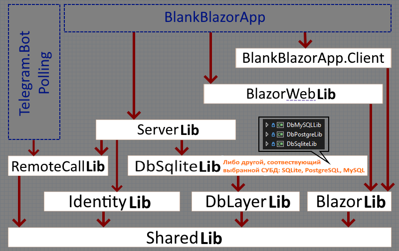

## Blazor NET.8 + TelegramBot

- Заготовка **Blazor NET.8**[^4] + **TelegramBot**[^5]: подойдёт как стартовый кейс web решения с поддержкой **Telegram бота**.

- База данных (по умолчанию) [SQLite](https://github.com/badhitman/DesignerApp/tree/main/DBContextLibs#sqlite-установлен-по-умолчанию): миграции отсутствуют, поскольку изначально не понятно какая в итоге СУБД будет выбрана[^10]. Для переключения с **SQLite** на [PostgreSQL](https://github.com/badhitman/DesignerApp/tree/main/DBContextLibs#postgresql) или [MySQL](https://github.com/badhitman/DesignerApp/tree/main/DBContextLibs#mysql): потребуется отредактировать зависимости проектов[^6]. После того как определились с используемой СУБД (*или оставили как есть*: **SQLIte**) - можно использовать миграции [^10].

- Связь между службами реализована через RabbitMQ[^1] в режиме `запрос-ответ`: при отправке сообщения в очередь, отправитель дожидается ответ (в границах таймаута) и возвращает результат вызывающему. При использовании вызова такой команды удалённого сервиса проходит так, как если бы это был обычный `await` запрос к базе данных или rest/api.

> [!IMPORTANT]
> В принципе служба *TelegramBot* могла бы использовать прямой доступ к данным через сервисы как это делает `BlazorWebApp` (достаточно установить зависимость от `ServerLib`), тогда `RemoteCallLib` становится бесполезным и его можно даже удалить (+ заменить зависимости сервисов на серверные). Но в данной реализации *Telegram* бот не связан с серверной инфраструктурой.

Зависимости решения:


### Службы:
#### 1. Telegram.Bot.Polling
- В оригинальном исполнении `Worker Service`[^5].
- Ответы на входящие Telegram сообщения обрабатывает реализация интерфейса `ITelegramDialogService`[^7]. Пользователям индивидуально устанавливается имя автоответчика[^2]. Это касается как простых текстовых `Message`, так и `CallbackQuery`.
- Через RabbitMQ служба получает команды от внешних систем, выполняет их, а результат возвращает ответом отправителю (*например команда*: отправка сообщения Telegram клиенту от имени бота)[^1].

#### 2. WEB-Blazor
- Авторизация типовая `Microsoft.AspNetCore.Identity`.
- В Frontend добавлен базовый функционал для работы с пользователями, ролями и Telegram[^4]. 
- Служба равно как и **Telegram.Bot.Polling** использует RabbitMQ для того что бы обслуживать команды, на которые она зарегистрировала обработчики[^1].
 
 ### Настройка
 - Перед запуском служб Blazor[^4] и Telegram бота[^5] потребуются конфиги **MQ**, **Email** (отправка писем **SMTP**. в. т.ч. для **Identity**) и **TelegramBot** токен.
- Помимо стандартных настроек **appsettings.json** потребуется отдельная папка где будут храниться приватные данные: логины и пароли к внешним системам. В обоих службах поиск/чтение секретов происходит подобным образом
```C#
// Secrets
string secretPath = Path.Combine("..", "secrets");
for (int i = 0; i < 5 && !Directory.Exists(secretPath); i++)
  secretPath = Path.Combine("..", secretPath);
if (Directory.Exists(secretPath))
  foreach (string secret in Directory.GetFiles(secretPath, $"*.json"))
    configHost.AddJsonFile(Path.GetFullPath(secret), optional: true, reloadOnChange: true);
else
  logger.Warn("Секреты не найдены");
```
Приложение ищет папку с именем `secret` на уровне выше текущей директории, а если не находит нужной папки, то пытается искать её ещё выше и выше в иерархии папок пути до исполняемого файла. На этапе разработки эти файлы могут лежать например тут: C:\Users\ _ИмяПользователя_ \source\repos\secrets

В папке секретов `secrets` предполагается наличие следующих настроек:

- RabbitMQ подключение потребуется для обоих служб.
```json
{
  "RabbitMQConfig": {
    "UserName": "debug",
    "Password": "debug",
    "VirtualHost": "/"
  }
}
```

- Email (SMTP) потребуется для службы **BlazorWebApp**. *В том числе для отправки уведомлений подсистемой авторизации* `Microsoft.AspNetCore.Identity`.
```json
{
  "SmtpConfig": {
    "Email": "ваш-email@домен",
    "Login": "логин-для-smtp",
    "Password": "ваш-пароль-для-smtp",
    "Host": "smtp-адрес-хоста",
    "Port": 465
  }
}
```
Если отправка Email у вас происходит иначе чем обычный SMTP, тогда реализуйте `IMailProviderService` на своё усмотрение и предусмотрите свои настройки.

- Токен **TelegramBot** для соответствующей службы `Telegram.Bot.Polling`
```json
{
  "BotConfiguration": {
    "BotToken": "ваш-токен-для-бота"
  }
}
```
Создать бота и получить свой токен можно у [@BotFather](https://t.me/BotFather)

### Роль Admin (полные права) можно назначит через *.json конфигурацию
У службы BlazorWebApp можно настроить Email адреса клиентов таким образом, что бы закрепить за ними любые произвольные роли. Это полезно, например, для первого старта приложения: администратор прописывает свой Email под которым он будет авторизовываться с необходимыми ему ролями, тогда они будут проверяться при каждом входе клиента. Если необходимых ролей не окажется в системе, то они будут автоматически созданы. Клиент обязательно получит роли, которые ему были прописаны в конфигурации. Пример настроек:
```json
{
  "UserManage": {
    "UpdatesUsersRoles": [
      {
        "EmailUser": "ваш_email@сайт.ru",
        "SetRoles": [ "admin" ]
      },
      {
        "EmailUser": "другой_email@домен.com",
        "SetRoles": [ "manager" ]
      }
    ]
  }
}
```
прописать можно любые роли любым клиентам. после этого им нужно залогиниться - нужные роли обязательно будут у клиента.

[^1]: Подробнее про реализацию MQTT транспорта можно узнать [тут](https://github.com/badhitman/DesignerApp/tree/main/RemoteCallLib).

[^2]: Имя обработчика ответов храниться в [контексте пользователя](https://github.com/badhitman/DesignerApp/blob/main/SharedLib/Models/TelegramUserBaseModelDb.cs#L45). Подробнее [тут](https://github.com/badhitman/DesignerApp/tree/main/ServerLib/Services/TelegramDialog#%D0%BA%D0%BE%D0%BD%D1%82%D0%B5%D0%BA%D1%81%D1%82-%D1%85%D1%80%D0%B0%D0%BD%D0%B5%D0%BD%D0%B8%D1%8F-%D0%B8%D0%BC%D0%B5%D0%BD%D0%B8-%D0%BE%D0%B1%D1%80%D0%B0%D0%B1%D0%BE%D1%82%D1%87%D0%B8%D0%BA%D0%B0-%D0%B4%D0%BB%D1%8F-%D0%BF%D0%BE%D0%BB%D1%8C%D0%B7%D0%BE%D0%B2%D0%B0%D1%82%D0%B5%D0%BB%D1%8F)

[^4]: Стандартная ASP служба [Blazor WebApp](https://github.com/badhitman/DesignerApp/tree/main/BlankBlazorApp/BlankBlazorApp). За основу взята [эта работа](https://github.com/dotnet/blazor-samples/tree/175634ec31942b181f211008e8841c26e91f33e5/8.0/BlazorWebAssemblyStandaloneWithIdentity).

[^5]: WorkerService служба [Telegram.Bot.Polling](https://github.com/badhitman/DesignerApp/tree/main/Telegram.Bot.Polling) сделана на основе [Telegram.Bot.Examples.Polling](https://github.com/TelegramBots/Telegram.Bot.Examples/tree/d7dd05e12ae97c5949804b465a8a87e3f894c3f2/Telegram.Bot.Examples.Polling).

[^6]: Про переключение контекста между разными СУБД можно узнать [тут](https://github.com/badhitman/DesignerApp/tree/main/DBContextLibs).

[^7]: Свой обработчик ответа на входящее сообщение Telegram реализуется через [интерфейс](https://github.com/badhitman/DesignerApp/blob/main/SharedLib/IServices/ITelegramDialogService.cs) и [регистрации его в **Program.cs**](https://github.com/badhitman/DesignerApp/blob/main/Telegram.Bot.Polling/Program.cs#L84) службы **TelegramBot**.

[^8]: Служба Telegram бота для каждого входящего сообщения [проверяет статус пользователя через вызов удалённой команды](https://github.com/badhitman/DesignerApp/blob/main/Telegram.Bot.Polling/Services/UpdateHandler.cs#L53), которую в данном случае обрабатывает Web сервер Blzaor.

[^9]: [Бот ищет по имени нужного обработчика. Если не находит, то использует базовый](https://github.com/badhitman/DesignerApp/blob/main/Telegram.Bot.Polling/Services/UpdateHandler.cs#L131).

[^10]: Если SQLite подходит, то можно сразу формировать миграции для контекстов: `IdentityAppDbContext` (отдельный контекст для **Microsoft.AspNetCore.Identity**) и `MainDbAppContext`.