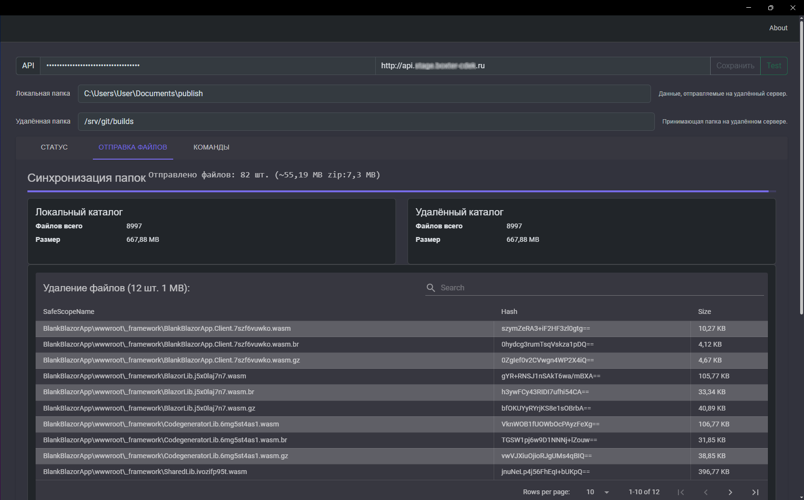
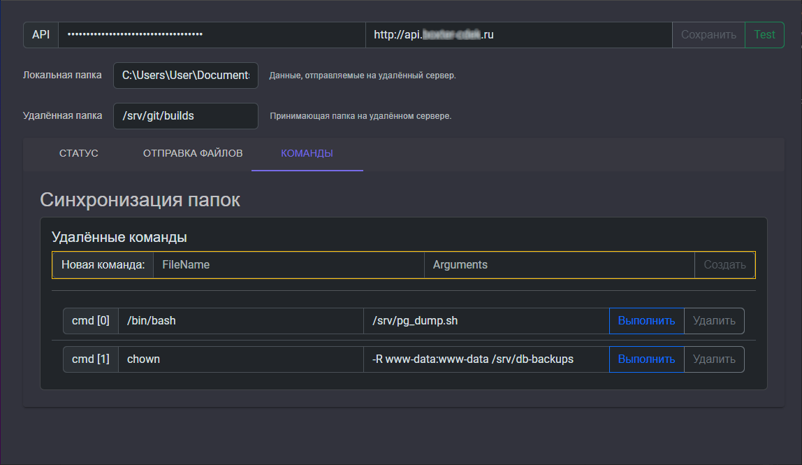
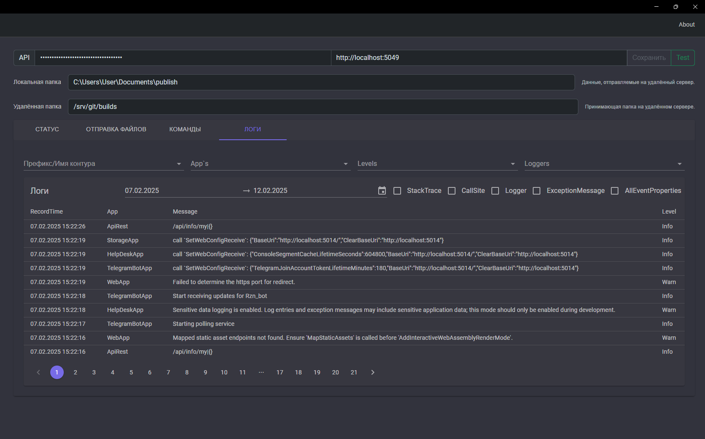

# Tools (system)
Утилита доступа к штатному rest/api (win/android).

### Функции
- Синхронизация (односторонняя) папок локальной (win/android) с удалённой (на сайте). Сверка файлов производится по имени, размеру и md5:hash файла. На сервер будут доставлены только новые или изменённые файлы, а лишние будут удалены: локальная папка устройства будет спроецирована/клонирована в папку на сайте. Каждый файл отправляется отдельно (по одному за раз), а перед отправкой сжимается ZipFile (*System.IO.Compression*).
- Удалённый вызов команд (shell/cmd). Клиент может отправлять на удалённый сервер произвольные shell команды. Команды выполняются от имени пользователя под которым запущен RestApi.
- Просмотр логов решения: api/rest предоставляет доступ к чтению общих логов, а win/android клиент его использует 