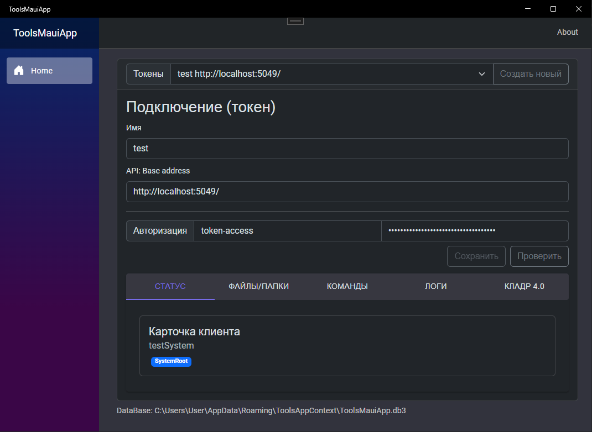

# Tools over API Rest
Утилита (win/android, а так же mac/ios) для доступа к штатному rest/api системы. Удалённый доступ минуя Web сервис и штатную Identity авторизацию. В данном случае используется токен доступа для rest/api микро-сервиса с применением [RBAC](https://ru.wikipedia.org/wiki/%D0%A3%D0%BF%D1%80%D0%B0%D0%B2%D0%BB%D0%B5%D0%BD%D0%B8%D0%B5_%D0%B4%D0%BE%D1%81%D1%82%D1%83%D0%BF%D0%BE%D0%BC_%D0%BD%D0%B0_%D0%BE%D1%81%D0%BD%D0%BE%D0%B2%D0%B5_%D1%80%D0%BE%D0%BB%D0%B5%D0%B9).

### Добавление токенов

Добавляйте токены, которым в свою очередь гибко настраивайте персональные права доступа.

### Функции
- Синхронизация локальной папки (win/android/mac/ios) с удалённой папкой. Сверка файлов производится по имени, размеру и md5:hash файла. Доставлены будут только новые или изменённые файлы, а лишние будут удалены. Каждый файл отправляется отдельно (по одному за раз), а перед отправкой сжимается ZipFile (*System.IO.Compression*).
- Удалённый вызов команд (shell/cmd). Клиент может отправлять на удалённый сервер произвольные shell команды. Команды выполняются от имени пользователя под которым запущен RestApi.
- Просмотр логов решения: api/rest предоставляет доступ к чтению общих логов, а win/android клиент его использует 

Для каждого отдельного api/res подключения настраивайте папки синхронизации и удалённые команды. Кроме того предоставляется доступ к логам и управление базой КЛАДР 4.0